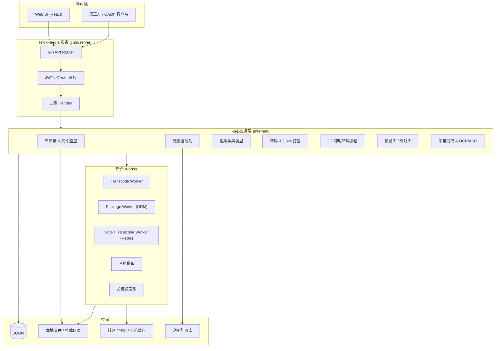
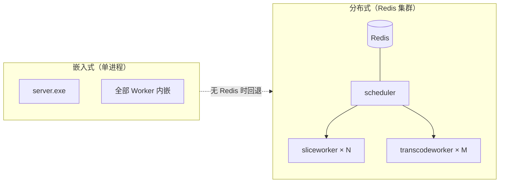
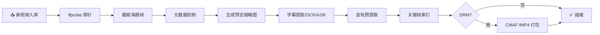
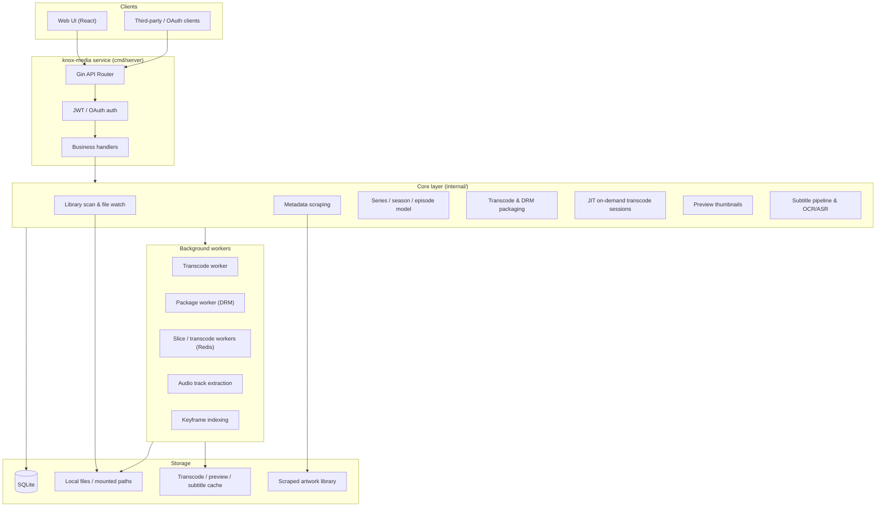
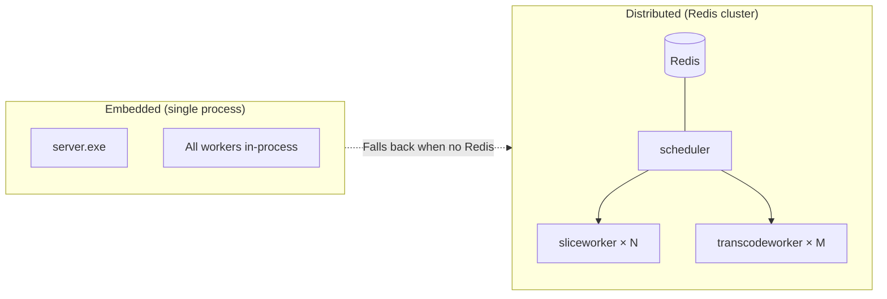
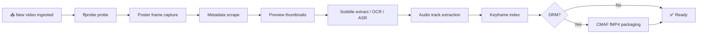

# Knox-Media

**Knox 全媒体平台 · 轻量级家庭媒体服务器** / *Lightweight home media server for the Knox omnimedia platform*

[](https://go.dev)
[](https://react.dev)
[](https://www.typescriptlang.org)
[](https://sqlite.org)
[](https://docker.com)
[](./LICENSE)

[中文](#中文) · [English](#english)

---

<a id="中文"></a>

## 中文

### 项目简介

**Knox-Media** 是 Knox 全媒体平台的媒体子系统，采用 **Go + React** 构建，定位为轻量级家庭/个人媒体中心，对标 Jellyfin、Emby 等产品的核心体验。系统可独立部署，也可作为微服务供 Knox 其他模块通过 REST API 调用。

| 项目 | 说明 |
|------|------|
| 后端 | Go 1.22 · Gin · SQLite · Redis（可选） |
| 前端 | React 19 · TypeScript · Ant Design 6 · Vite 8 |
| 媒体引擎 | FFmpeg / FFprobe · Shaka Packager |
| 默认端口 | `8200` |
| 运行环境 | Windows / Linux / macOS / Docker |

**默认演示账号**（首次启动自动创建，生产环境请立即修改）：

| 用户名 | 密码 | 角色 |
|--------|------|------|
| `admin` | `admin123` | 管理员 |
| `viewer` | `viewer123` | 普通用户 |

---

### 功能矩阵

| 功能域 | 核心能力 |
|--------|----------|
| 📁 媒体库 | 电影 · 剧集 · 动漫 · 音乐 · 图片 · 文档，多路径多库管理 |
| ▶️ 播放引擎 | 直链 MP4 · HLS 自适应转码 · JIT 按需切片 · 多播放器引擎自动切换 |
| 🔍 元数据刮削 | TMDB · TVDB · 豆瓣 · Bangumi · OMDb · AI 大模型兜底 |
| 🔐 内容保护 | Widevine · FairPlay · PowerDRM · HLS AES-128，内置许可证服务 |
| 🖼️ 预览图 | 进度条 sprite 缩略图 + WebVTT 时间线 |
| 📝 字幕 | 内嵌轨提取 · Sidecar 扫描 · PGS 图形 OCR · Whisper ASR |
| 🎵 多音轨 | 音轨预提取，多音轨 HLS master playlist |
| 👥 用户管理 | 多角色 · 库级 ACL · 家长控制（分级+PIN+时段） |
| 🔒 安全 | JWT · OAuth 客户端凭证 · Bearer / Query Token 双模式 |
| 🛠️ 扩展 | 嵌入式部署 → Docker → 分布式 Redis 集群 |

---

### 系统架构

#### 核心架构



#### 部署模式



#### 媒体入库流水线



#### 架构要点

1. **单体可部署**：`cmd/server` 嵌入前端静态资源（`web/dist`），一条命令即可启动完整服务。
2. **流水线式入库**：扫描或上传新视频后，自动排队本地海报截帧 → 刮削 → 预览图 → 字幕 → 音轨/关键帧 →（可选）DRM 打包 / JIT 预准备。
3. **多层播放策略**：浏览器可直解的 MP4 走直链；不兼容格式走 HLS 自适应转码；高阶场景支持 JIT 按需切片转码、Widevine / FairPlay / PowerDRM 加密流。
4. **分布式扩展（可选）**：Redis + `cmd/scheduler` + `cmd/sliceworker` + `cmd/transcodeworker` 组成即时转码集群；无 Redis 时回退到进程内 Session JIT（不依赖 Redis）。
5. **开放集成**：OAuth 客户端凭证、播放 URL 支持 `access_token` 查询参数，便于 HTML5 播放器与外部系统集成。

#### 目录结构

```
media/
├── cmd/
│   ├── server/           # 主服务入口
│   ├── scheduler/        # JIT 调度（Redis）
│   ├── schedulerd/       # 调度 daemon（独立进程）
│   ├── sliceworker/      # 分布式切片 Worker
│   ├── sliceworkerd/     # 切片 daemon（独立进程）
│   ├── transcodeworker/  # 分布式转码 Worker
│   └── transcodeworkerd/ # 转码 daemon（独立进程）
├── api/
│   ├── handler/          # REST 处理器（~49 文件）
│   ├── middleware/       # JWT 鉴权 · CORS
│   └── router.go
├── internal/
│   ├── scanner/          # 库扫描 · fsnotify 文件监控
│   ├── scraper/          # TMDB / 豆瓣 / Bangumi 等刮削
│   ├── tvparse/          # 剧集文件名解析
│   ├── tvstore/          # 剧集·季·集数据模型
│   ├── transcode/        # HLS 转码 & CMAF DRM 打包
│   ├── drm/              # 本地许可证服务
│   ├── jit/              # 即时转码（会话/调度/预加热）
│   ├── preview/          # 进度条预览缩略图
│   ├── subtitle/         # 字幕流水线（提取/OCR/ASR）
│   ├── atrack/           # 音轨提取
│   ├── keyframe/         # 关键帧索引
│   ├── upload/           # 分片上传服务
│   ├── monitor/          # 文件变更实时监控
│   ├── metadatalib/      # 刮削配图本地库
│   ├── mediautil/        # 编解码器兼容性检查
│   ├── config/           # YAML 配置加载
│   ├── store/            # SQLite schema & 迁移
│   ├── auth/             # JWT 生成与验证
│   └── model/            # 内部数据模型
├── pkg/
│   ├── ffprobe/          # FFprobe 封装
│   ├── fileutil/         # 文件工具
│   └── hashutil/         # 哈希计算
├── web/                  # React 前端 SPA
│   └── src/pages/        # 首页 · 浏览 · 播放 · 管理 · 设置
├── tools/
│   ├── ffmpeg/bin/       # ffmpeg/ffprobe 二进制
│   ├── shaka-packager/   # Shaka Packager 二进制
│   ├── asr/              # ASR 脚本（Whisper/Paraformer）
│   └── subtitle_ocr/     # 图形字幕 OCR 脚本
├── data/                 # 运行时数据（数据库/缓存/上传）
├── config.yml            # 运行配置
├── Dockerfile
└── docker-compose.yml
```

---

### 快速开始

#### 环境准备

- Go 1.22+
- Node.js 20+（仅开发前端时需要）
- FFmpeg / FFprobe（可使用 `tools/download_media_tools.ps1` 下载内置二进制）

#### 配置关键项

首次部署前，编辑 `config.yml` 至少修改以下配置：

```yaml
security:
  jwt_secret: "change-me-in-production-use-long-random-string"  # ⚠️ 必改

ffmpeg:
  ffprobe_path: "tools/ffmpeg/bin/ffprobe.exe"   # Windows
  ffmpeg_path:  "tools/ffmpeg/bin/ffmpeg.exe"    # Linux: /usr/bin/ffmpeg

# 如需 DRM 加密
drm:
  widevine:
    enabled: false  # 需配置外部许可证服务
  powerdrm:
    enabled: true   # 内置自定义加密，开箱即用
```

#### 开发模式

```powershell
# 后端（工作目录 = media/）
go run ./cmd/server

# 前端（另开终端）
cd web
npm install
npm run dev    # http://localhost:5173，API 代理到 :8200
```

#### 生产模式

```powershell
cd web && npm run build && cd ..
go build -o knox-media ./cmd/server
./knox-media    # 单端口提供 API + 静态前端
```

#### Docker

```bash
# 构建
docker build -t knox-media .

# 运行
docker run -d \
  --name knox-media \
  -p 8200:8200 \
  -v ./data:/app/data \
  -v /your/media:/media \
  knox-media
```

```yaml
# docker-compose.yml（项目自带）
version: "3.8"
services:
  knox-media:
    build: .
    ports:
      - "8200:8200"
    volumes:
      - ./data:/app/data
      - /your/media:/media          # 媒体文件目录
      - ./config.yml:/app/config.yml # 可选：挂载自定义配置
    environment:
      - KNOX_MEDIA_CONFIG=/app/config.yml
    restart: unless-stopped
```

#### 首次使用

1. 浏览器访问 `http://localhost:8200`
2. 使用默认账号 `admin` / `admin123` 登录
3. 进入 **管理后台 → 媒体库**，创建媒体库（选择类型：电影/剧集等）
4. 为媒体库 **添加文件夹**（指向存放视频的目录，Docker 需确保路径已挂载）
5. 点击 **扫描**，系统将自动：
   - 发现视频文件 → ffprobe 解析元数据
   - 自动刮削海报、简介、演员等信息
   - 生成预览缩略图和字幕
6. 扫描完成后返回首页，即可浏览和播放

---

### 已实现功能

#### 媒体库与扫描

- 支持库类型：**电影、剧集、动漫、其他影片**（完整浏览播放体验）；音乐/图片/文档类型可创建库并扫描入库，尚无专属浏览与播放 UI
- 多路径文件夹、启用/禁用、自动扫描、**实时文件监控**（fsnotify）
- 全量/增量扫描任务，扫描进度与取消
- 视频/音频文件识别，ffprobe 元数据解析（分辨率、编码、时长等）
- **剧集文件名解析**（`S01E01`、`Season 1` 等模式），**剧集聚合浏览**（`/series/:id`）
- 季集视图：按系列分组、季选择、剧集列表展示

#### 元数据刮削

- 刮削源：**TMDB、TVDB、豆瓣、Bangumi、OMDb**，以及 **AI 大模型** 兜底
- 自动刮削（入库触发）与批量刮削任务
- 手动匹配/取消匹配、标题解析、TMDb 配图搜索
- 刮削配图本地落盘（`metadata/library`），海报/背景/Logo 管理
- 剧集级刮削（按季集匹配系列元数据）

#### 播放体验

- **直链播放**（浏览器兼容的 MP4/H.264+AAC）
- **HLS 自适应转码**（多码率 master playlist）
- **JIT 即时转码**（按需切片，支持 seek/pause/resume/end）
- 播放器引擎：**PowerPlayer、xgplayer、Shaka Player**（按场景自动选择）
- 进度条 **预览缩略图**（sprite + WebVTT）
- 多音轨 HLS（可配置）、外挂/内嵌字幕 WebVTT 输出
- **断点续播**、已观看标记、播放历史与筛选

#### 内容保护

- 库级 `drm_enabled` 开关，CMAF fMP4 HLS 打包（Shaka Packager + FFmpeg 回退）
- **Widevine、FairPlay、PowerDRM、HLS AES-128** 播放链路
- 内置许可证端点与管理端审计/验签调试接口
- 上传本地源文件打包后可选择性清理源文件（仅 upload 路径，不删挂载媒体）

#### 字幕与音轨

- 扫描时自动创建字幕任务：内嵌轨提取、同目录 sidecar（srt/ass/ssa/vtt/sub 等）
- 可选 **Whisper ASR** 语音识别字幕、**PGS 图形字幕 OCR**（Tesseract）
- 音轨预提取（独立 HLS 音轨，降低转码成本，支持多音轨切换）

#### 用户端功能

- 首页：媒体库卡片、**继续观看**、最近添加
- 浏览：海报/缩略图/列表/表格多视图，排序与库筛选
- 剧集库：按系列聚合展示，季集详情页
- 收藏、**播放列表**（支持排序与多图）、搜索（标题关键字）
- 个人设置：资料、密码、头像上传、播放器偏好（字幕语言等）

#### 上传与管理

- 单文件上传、**分片上传+合并**、上传目录创建
- 媒体资料管理（标题、元数据、配图 URL 编辑）
- 媒体删除（含关联任务/缓存清理计划）
- 管理员控制台：CPU/内存/磁盘实时概览、SSE 活动流

#### 管理后台

- 媒体库 CRUD、扫描控制与进度
- 任务中心：转码/预览/刮削/字幕/扫描/音轨/关键帧/定时任务
- 刮削配置（提供商开关与优先级）、AI Provider 配置（OpenAI/DeepSeek/通义/Ollama）
- 用户管理（角色/权限/库范围/家长控制）、API 凭证管理
- DRM 许可证审计、访问日志

#### 权限与安全

- 多用户（管理员/普通用户），**媒体库级 ACL**、文件夹级权限
- **家长控制**（分级上限 + PIN + 时段窗口 + 每日计划）
- JWT 会话、OAuth 客户端凭证（供外部播放集成）
- 访问日志、401/403 权限拦截前端提示

---

### API 概览

| 端点 | 鉴权 | 说明 |
|------|------|------|
| `POST /api/v1/user/login` | 无 | 用户登录，获取 JWT |
| `POST /api/v1/oauth/token` | OAuth | OAuth 客户端凭证换取 Token |
| `GET /api/v1/user/info` | JWT | 当前用户信息 |
| `GET /api/v1/library` | JWT | 获取媒体库列表 |
| `GET /api/v1/media` | JWT | 媒体列表（支持库/排序/分页） |
| `GET /api/v1/media/:id/play` | JWT/Token | 播放信息与策略 |
| `GET /api/v1/media/:id/hls/*` | Token | HLS 流（段/播放列表） |
| `GET /api/v1/media/:id/preview/*` | Token | 预览缩略图 |
| `GET /api/v1/media/:id/subtitles/:sid/vtt` | Token | 字幕 WebVTT |
| `GET /api/v1/proxy/image` | JWT | 图片代理（跨域海报） |
| `POST /api/v1/drm/widevine/license` | Token | Widevine 许可证 |
| `POST /api/v1/drm/fairplay/license` | Token | FairPlay 许可证 |
| `GET /api/v1/drm/powerdrm/key` | Token | PowerDRM 密钥 |
| `POST /api/v1/jit/session/:id/seek` | Token | JIT 会话跳转 |
| `POST /api/v1/library` | Admin | 创建媒体库 |
| `POST /api/v1/scan` | Admin | 触发库扫描 |
| `GET /api/v1/admin/overview` | Admin | 管理仪表盘 |

> 管理端点（库/用户/任务/系统配置/DRM审计等）全部要求 Admin 角色。

---

### 开发计划

#### 版本分层路线

来源于 `docs/TODO.MD`，按目标用户分层推进：

| 层级 | 定位 | 核心特性 |
|------|------|----------|
| **Standard**（大众版） | 家庭个人用户 | GPU 硬件加速 · 标准加密 · AI 刮削 · 语音识别字幕 · 客户端码率切换 · 一键导入 Plex/Emby/Jellyfin · 视频目录变更自动适配 · 用户 3/并发 3 |
| **Premium**（专业版） | 高级用户/小团队 | 私有加密 · 本地剪辑 · 远程访问 · DRM 加密 · 电子书（PDF/MOBI/EPUB/DOCX） · 用户 10/并发 20 |
| **Enterprise**（企业版） | 平台集成 | 兼容 PowerCMS 11（上传/浏览/URL 上传/转码） · 用户数定制 · 平台授权管理 |

#### 技术路标

| 方向 | 说明 |
|------|------|
| 音乐模块 | 专辑/歌手/流派视图、歌词、封面墙、专用播放器 |
| 图片模块 | 时间轴、相册分类、幻灯片、EXIF 浏览 |
| 文档模块 | 文档预览、全文检索 |
| 高级检索 | Bleve/OpenSearch 全文索引，替代当前标题关键字过滤 |
| 远程入库 | URL 离线下载、WebDAV 服务端 |
| 存储协议 | 库路径抽象为 NFS/SMB/WebDAV/S3（当前为本地或 OS 挂载路径） |
| 数据库 | PostgreSQL 可选后端（当前仅 SQLite） |
| NFO 双向同步 | 完整 NFO 读写与 Jellyfin/Emby 目录结构兼容 |
| 访客角色 | 只读访客账号、播放并发/带宽限速 |
| 分布式集群 | 与 Knox 任务中心/独立转码服务深度集成的生产级集群方案（参见分布式集群部署文档） |
| 移动端 | 原生 App/PWA 离线缓存 |
| 多语言 UI | 前端界面国际化（后端已支持用户 `ui_locale` 字段） |

---

### 相关文档

| 文档 | 用途 |
|------|------|
| [FUNCTIONAL_TEST.md](./FUNCTIONAL_TEST.md) | 功能回归测试清单 |
| [cmd/scheduler/README.md](./cmd/scheduler/README.md) | JIT 即时转码调度架构 |
| [分布式媒体处理于转码集群部署手册.MD](./docs/分布式媒体处理于转码集群部署手册.MD) | 分布式转码集群部署（扩展模式） |

---

<a id="english"></a>

## English

### Overview

**Knox-Media** is the media subsystem of the Knox omnimedia platform, built with **Go + React** as a lightweight home/personal media server comparable to Jellyfin or Emby. It runs standalone or as a microservice exposing REST APIs to other Knox modules.

| Item | Details |
|------|---------|
| Backend | Go 1.22 · Gin · SQLite · Redis (optional) |
| Frontend | React 19 · TypeScript · Ant Design 6 · Vite 8 |
| Media stack | FFmpeg / FFprobe · Shaka Packager |
| Default port | `8200` |
| Platforms | Windows / Linux / macOS / Docker |

**Default demo accounts** (seeded on first boot — change in production):

| Username | Password | Role |
|----------|----------|------|
| `admin` | `admin123` | Administrator |
| `viewer` | `viewer123` | Regular user |

---

### Feature Matrix

| Domain | Capabilities |
|--------|-------------|
| 📁 Libraries | Movies · TV · Anime · Music · Photos · Documents, multi-folder per library |
| ▶️ Playback | Direct MP4 · HLS ABR · JIT segment transcode · Multi-engine auto-select |
| 🔍 Metadata | TMDB · TVDB · Douban · Bangumi · OMDb · AI LLM fallback |
| 🔐 DRM | Widevine · FairPlay · PowerDRM · HLS AES-128, built-in license service |
| 🖼️ Previews | Sprite thumbnails + WebVTT timeline for scrubber |
| 📝 Subtitles | Embedded extraction · Sidecar scan · PGS OCR · Whisper ASR |
| 🎵 Multi-audio | Pre-extracted tracks, multi-audio HLS master playlist |
| 👥 Users | Multi-role · Library ACL · Parental controls (ratings+PIN+schedules) |
| 🔒 Security | JWT · OAuth client credentials · Bearer / Query token dual mode |
| 🛠️ Scale | Embedded → Docker → Distributed Redis cluster |

---

### System Architecture

#### Core Architecture



#### Deployment Modes



#### Media Ingest Pipeline



#### Key Design Points

1. **Single-binary deployment** — `cmd/server` serves embedded frontend assets (`web/dist`).
2. **Ingest pipeline** — new videos trigger poster capture → scrape → preview sprites → subtitles → audio/keyframe jobs → (optional) DRM packaging / JIT pre-warm.
3. **Tiered playback** — direct MP4 when browser-compatible; HLS ABR transcode otherwise; JIT segment transcode and Widevine / FairPlay / PowerDRM for protected content.
4. **Optional scale-out** — Redis-backed scheduler + slice/transcode workers; falls back to in-process session JIT when Redis is unavailable.
5. **Integration-friendly** — OAuth client credentials; playback URLs accept `access_token` query param for HTML5 players.

#### Project Layout

```
media/
├── cmd/
│   ├── server/           # Main entrypoint
│   ├── scheduler/        # JIT scheduler (Redis)
│   ├── schedulerd/       # Scheduler daemon (standalone)
│   ├── sliceworker/      # Distributed slice worker
│   ├── sliceworkerd/     # Slice daemon (standalone)
│   ├── transcodeworker/  # Distributed transcode worker
│   └── transcodeworkerd/ # Transcode daemon (standalone)
├── api/
│   ├── handler/          # REST handlers (~49 files)
│   ├── middleware/       # JWT auth · CORS
│   └── router.go
├── internal/
│   ├── scanner/          # Library scan · fsnotify file watcher
│   ├── scraper/          # TMDB / Douban / Bangumi providers
│   ├── tvparse/          # TV filename parser
│   ├── tvstore/          # Series·season·episode models
│   ├── transcode/        # HLS transcode & CMAF DRM packaging
│   ├── drm/              # Local license service
│   ├── jit/              # On-demand transcode (session/schedule/preheat)
│   ├── preview/          # Scrubber sprite thumbnails
│   ├── subtitle/         # Subtitle pipeline (extract/OCR/ASR)
│   ├── atrack/           # Audio track extraction
│   ├── keyframe/         # Keyframe indexing
│   ├── upload/           # Chunked upload service
│   ├── monitor/          # Real-time filesystem watcher
│   ├── metadatalib/      # Local artwork library
│   ├── mediautil/        # Codec compatibility checks
│   ├── config/           # YAML config loading
│   ├── store/            # SQLite schema & migrations
│   ├── auth/             # JWT generate & validate
│   └── model/            # Internal data models
├── pkg/
│   ├── ffprobe/          # FFprobe wrapper
│   ├── fileutil/         # File utilities
│   └── hashutil/         # Hash utilities
├── web/                  # React SPA frontend
│   └── src/pages/        # Home · Browse · Player · Admin · Settings
├── tools/
│   ├── ffmpeg/bin/       # ffmpeg/ffprobe binaries
│   ├── shaka-packager/   # Shaka Packager binary
│   ├── asr/              # ASR scripts (Whisper/Paraformer)
│   └── subtitle_ocr/     # Bitmap subtitle OCR scripts
├── data/                 # Runtime data (DB/caches/uploads)
├── config.yml            # Runtime configuration
├── Dockerfile
└── docker-compose.yml
```

---

### Quick Start

#### Prerequisites

- Go 1.22+
- Node.js 20+ (frontend dev only)
- FFmpeg / FFprobe (`tools/download_media_tools.ps1` downloads bundled binaries on Windows)

#### Key Configuration

Edit `config.yml` before first deployment — at minimum:

```yaml
security:
  jwt_secret: "change-me-in-production-use-long-random-string"  # ⚠️ Required

ffmpeg:
  ffprobe_path: "tools/ffmpeg/bin/ffprobe.exe"   # Windows
  ffmpeg_path:  "tools/ffmpeg/bin/ffmpeg.exe"    # Linux: /usr/bin/ffmpeg

# For DRM encryption
drm:
  widevine:
    enabled: false  # Requires external license service
  powerdrm:
    enabled: true   # Built-in custom encryption, works out-of-box
```

#### Development

```powershell
go run ./cmd/server          # from media/

cd web && npm install && npm run dev   # http://localhost:5173 → proxies API to :8200
```

#### Production

```powershell
cd web && npm run build && cd ..
go build -o knox-media ./cmd/server
./knox-media
```

#### Docker

```bash
# Build
docker build -t knox-media .

# Run
docker run -d \
  --name knox-media \
  -p 8200:8200 \
  -v ./data:/app/data \
  -v /your/media:/media \
  knox-media
```

```yaml
# docker-compose.yml (included in repo)
version: "3.8"
services:
  knox-media:
    build: .
    ports:
      - "8200:8200"
    volumes:
      - ./data:/app/data
      - /your/media:/media          # Your media files
      - ./config.yml:/app/config.yml # Optional: custom config
    environment:
      - KNOX_MEDIA_CONFIG=/app/config.yml
    restart: unless-stopped
```

Config file: `config.yml` (override path with `KNOX_MEDIA_CONFIG` env var).

#### First Use

1. Open `http://localhost:8200` in a browser
2. Login with `admin` / `admin123`
3. Go to **Admin Console → Libraries**, create a library (movie / TV / anime)
4. **Add folders** pointing to your video directories (Docker: ensure paths are mounted)
5. Click **Scan** — the system will:
   - Discover video files → ffprobe metadata
   - Auto-scrape posters, descriptions, cast info
   - Generate preview thumbnails and subtitles
6. Return to Home once scanning finishes — browse and play

---

### Implemented Features

#### Libraries & Scanning

- Library types: **movies, TV series, anime, general video** (full browse & playback); music/photo/document libraries can scan files but lack dedicated browse/play UI
- Multi-folder paths, enable/disable, auto-scan, **real-time filesystem watch** (fsnotify)
- Full & incremental scan tasks with progress and cancel
- Video/audio detection with ffprobe metadata (resolution, codec, duration, etc.)
- **Episode filename parsing** (`S01E01`, `Season 1`, …) and **series aggregation** (`/series/:id`) with season/episode detail views

#### Metadata Scraping

- Providers: **TMDB, TVDB, Douban, Bangumi, OMDb**, plus **AI LLM** fallback
- Auto-scrape on ingest and batch scrape tasks
- Manual match/unmatch, title parsing, TMDb image search
- Local artwork storage; poster / backdrop / logo management
- TV episode-level scraping tied to series metadata

#### Playback

- **Direct progressive** playback for browser-friendly MP4
- **HLS adaptive transcode** (multi-bitrate master playlist)
- **JIT on-demand transcode** (segment-based, seek/pause/resume/end)
- Player engines: **PowerPlayer, xgplayer, Shaka Player** (auto-selected per scenario)
- **Preview thumbnails** on the progress bar (sprite + WebVTT)
- Multi-audio HLS (configurable); embedded & external subtitles as WebVTT
- **Resume progress**, watched state, playback history with filtering

#### Content Protection

- Per-library `drm_enabled`; CMAF fMP4 HLS packaging (Shaka Packager + FFmpeg fallback)
- **Widevine, FairPlay, PowerDRM, HLS AES-128** playback paths
- Built-in license endpoints; admin audit & license verification tools
- Optional local-source cleanup after packaging (upload-origin files only)

#### Subtitles & Audio

- Auto subtitle tasks on scan: embedded track extract, sidecar files (srt/ass/ssa/vtt/sub/…)
- Optional **Whisper ASR** speech-to-text and **PGS bitmap OCR** (Tesseract)
- Pre-extracted audio tracks for cheaper video-only HLS segments, multi-track switching

#### End-User Features

- Home: library cards, **continue watching**, recently added
- Browse: poster / thumb / list / table views with sort & library filter
- TV libraries: series grid and season/episode detail pages
- Favorites, **playlists** (sortable, multi-image), title keyword search
- Settings: profile, password, avatar upload, player preferences (subtitle languages, etc.)

#### Upload & Administration

- Single-file upload, **chunked upload + merge**, mkdir under library root
- Media metadata editor (title, fields, image URLs)
- Deletion with related task/cache cleanup plan
- Admin console: real-time CPU/memory/disk overview, SSE activity stream

#### Admin Console

- Library CRUD & scan control with progress
- Task manager: transcode / preview / scrape / subtitle / scan / audio / keyframe / scheduled
- Scrape config (provider toggles & priority), AI provider config (OpenAI / DeepSeek / Tongyi / Ollama)
- User management (roles / permissions / library scope / parental controls), API credentials
- DRM license audit, access logs

#### Security & Access Control

- Multi-user (admin / regular), **per-library ACL**, per-folder permissions
- **Parental controls** (rating limits + PIN + time windows + daily schedules)
- JWT sessions; OAuth client credentials for external players
- Access logs; frontend permission-error prompts for 401/403

---

### API Overview

| Endpoint | Auth | Description |
|----------|------|-------------|
| `POST /api/v1/user/login` | None | User login, returns JWT |
| `POST /api/v1/oauth/token` | OAuth | OAuth client credentials → token |
| `GET /api/v1/user/info` | JWT | Current user profile |
| `GET /api/v1/library` | JWT | List media libraries |
| `GET /api/v1/media` | JWT | Media list (filter/sort/paginate) |
| `GET /api/v1/media/:id/play` | JWT/Token | Playback info & strategy |
| `GET /api/v1/media/:id/hls/*` | Token | HLS stream (segments/playlists) |
| `GET /api/v1/media/:id/preview/*` | Token | Preview thumbnails |
| `GET /api/v1/media/:id/subtitles/:sid/vtt` | Token | Subtitle WebVTT |
| `GET /api/v1/proxy/image` | JWT | Image proxy (cross-origin posters) |
| `POST /api/v1/drm/widevine/license` | Token | Widevine license |
| `POST /api/v1/drm/fairplay/license` | Token | FairPlay license |
| `GET /api/v1/drm/powerdrm/key` | Token | PowerDRM key |
| `POST /api/v1/jit/session/:id/seek` | Token | JIT session seek |
| `POST /api/v1/library` | Admin | Create library |
| `POST /api/v1/scan` | Admin | Trigger library scan |
| `GET /api/v1/admin/overview` | Admin | Dashboard overview |

> All admin endpoints (libraries / users / tasks / system config / DRM audit / etc.) require the Admin role.

---

### Roadmap

#### Tiered Version Plan

From `docs/TODO.MD`, organized by target audience:

| Tier | Audience | Key Features |
|------|----------|-------------|
| **Standard** | Home / personal users | GPU hardware acceleration · Standard encryption · AI scraping · ASR subtitles · Client-side bitrate switching · One-click import from Plex/Emby/Jellyfin · Auto-adapt to media directory changes · 3 users / 3 concurrent |
| **Premium** | Power users / small teams | Private encryption · Local clip editor · Remote access · DRM encryption · E-books (PDF/MOBI/EPUB/DOCX) · 10 users / 20 concurrent |
| **Enterprise** | Platform integration | PowerCMS 11 compatibility (upload/browse/URL upload/transcode) · Custom user count · Platform license management |

#### Technology Roadmap

| Area | Description |
|------|-------------|
| Music module | Album/artist/genre views, lyrics, cover wall, dedicated player |
| Photo module | Timeline, albums, slideshow, EXIF viewer |
| Document module | In-browser preview, full-text search |
| Advanced search | Bleve / OpenSearch index instead of client-side title filter |
| Remote ingest | URL download, WebDAV server |
| Storage backends | First-class NFS / SMB / WebDAV / S3 library paths (today: local or OS mounts) |
| Database | Optional PostgreSQL (SQLite only today) |
| NFO sync | Full read/write NFO; Jellyfin/Emby folder compatibility |
| Guest role | Read-only guest accounts; playback concurrency / bandwidth limits |
| Distributed cluster | Production-grade integration with Knox task center / standalone transcode fleet |
| Mobile | Native apps / PWA offline cache |
| UI i18n | Frontend locale switching (backend already stores `ui_locale` per user) |

---

### Related Docs

| Document | Purpose |
|----------|---------|
| [FUNCTIONAL_TEST.md](./FUNCTIONAL_TEST.md) | Manual regression checklist |
| [cmd/scheduler/README.md](./cmd/scheduler/README.md) | JIT transcode scheduler design |
| [分布式媒体处理于转码集群部署手册.MD](./docs/分布式媒体处理于转码集群部署手册.MD) | Distributed transcode cluster (extension mode) |

---

<p align="center"><a href="#中文">↑ 中文</a> · <a href="#english">↑ English</a></p>
