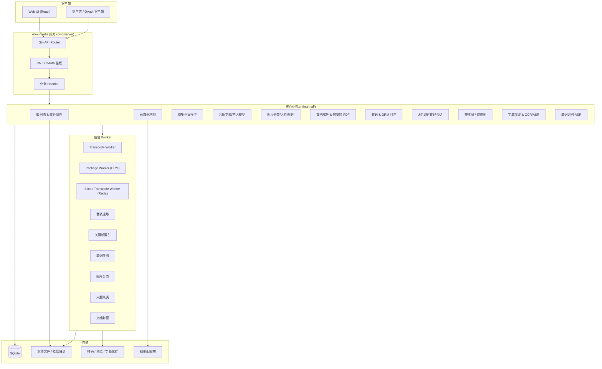
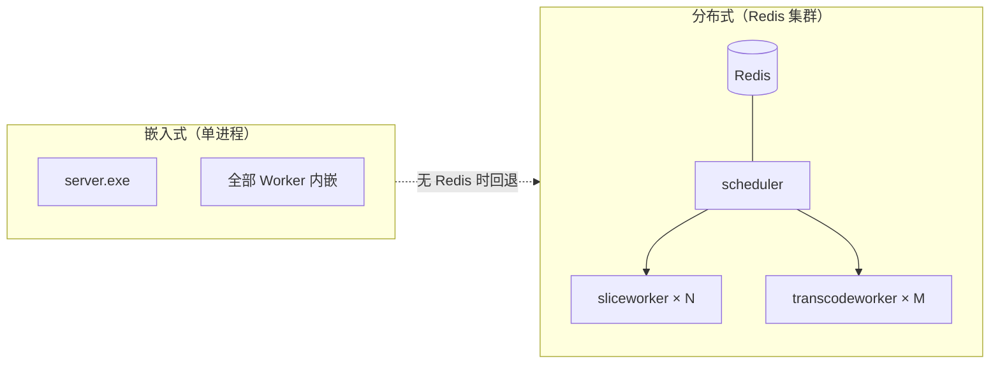
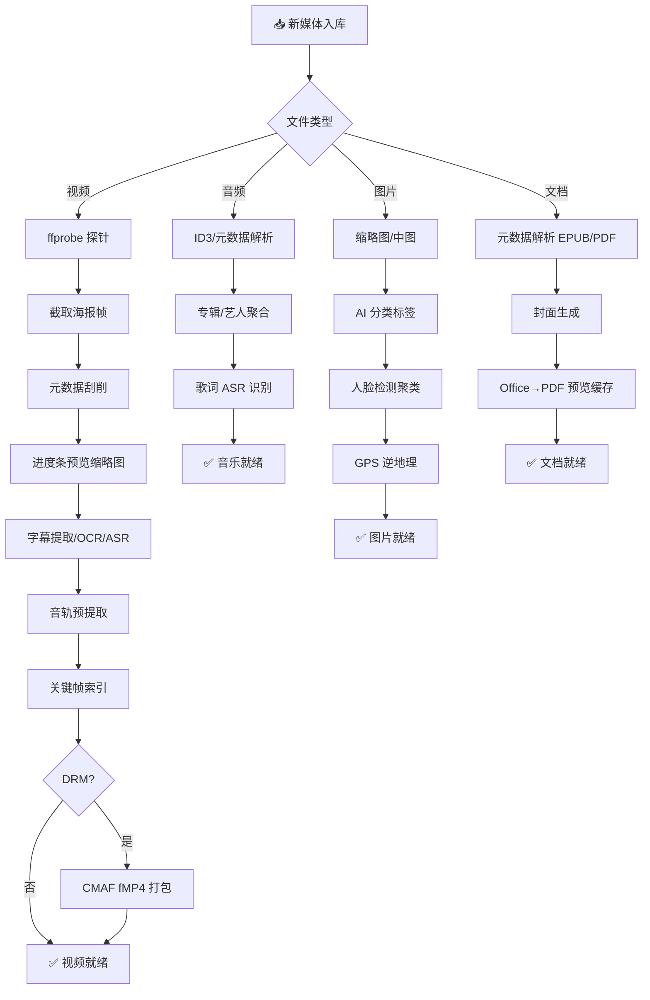
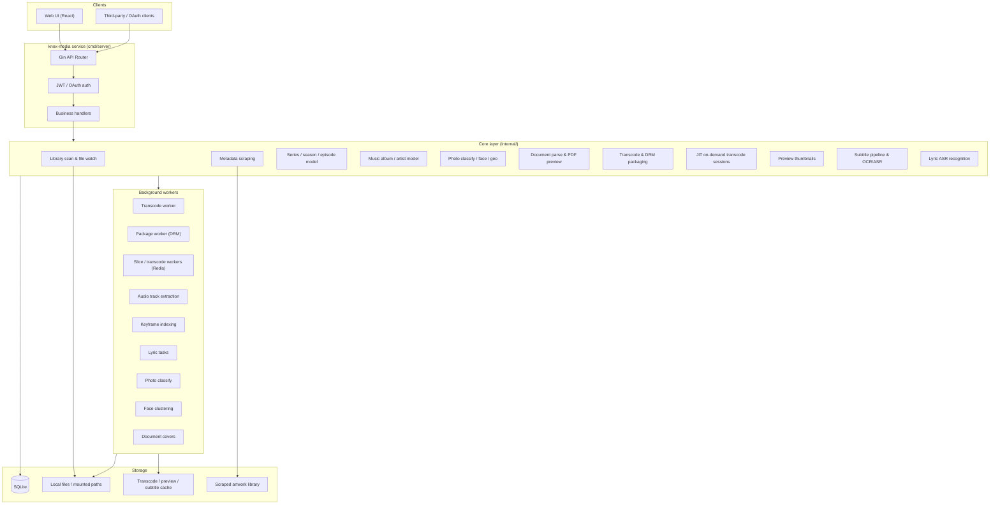
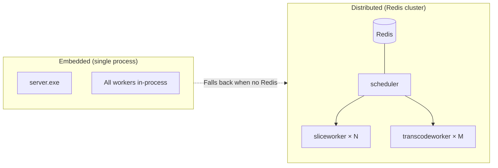
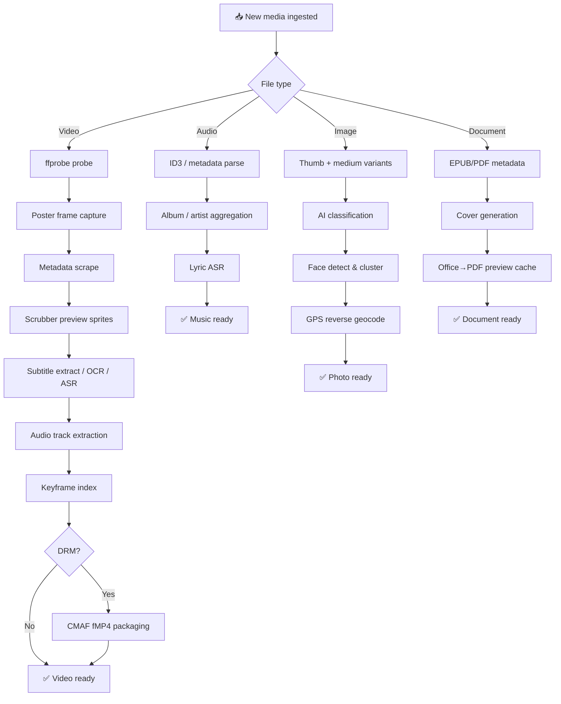

# Knox-Media

**Knox 全媒体平台 · 轻量级家庭媒体服务器** / *Lightweight home media server for the Knox omnimedia platform*

[](https://go.dev)
[](https://react.dev)
[](https://www.typescriptlang.org)
[](https://sqlite.org)
[](https://docker.com)
[](./LICENSE)

[中文](#中文) · [English](#english)

---

<a id="中文"></a>

## 中文

### 项目简介

**Knox-Media** 是 Knox 全媒体平台的媒体子系统，采用 **Go + React** 构建，定位为轻量级家庭/个人媒体中心，对标 Jellyfin、Emby 等产品的核心体验。系统可独立部署，也可作为微服务供 Knox 其他模块通过 REST API 调用。

| 项目 | 说明 |
|------|------|
| 后端 | Go 1.22 · Gin · SQLite · Redis（可选） |
| 前端 | React 19 · TypeScript · Ant Design 6 · Vite 8 |
| 媒体引擎 | FFmpeg / FFprobe · Shaka Packager |
| 默认端口 | `8200` |
| 运行环境 | Windows / Linux / macOS / Docker |

**默认演示账号**（首次启动自动创建，生产环境请立即修改）：

| 用户名 | 密码 | 角色 |
|--------|------|------|
| `admin` | `admin123` | 管理员 |
| `viewer` | `viewer123` | 普通用户 |

---

### 功能矩阵

| 功能域 | 核心能力 |
|--------|----------|
| 📁 媒体库 | 电影 · 剧集 · 动漫 · 音乐 · 图片 · 文档，多路径多库管理，各类型均有专属浏览/播放或阅读 UI |
| ▶️ 播放引擎 | 直链 MP4 · HLS/DASH 自适应转码 · JIT 按需切片 · 音乐全局播放器 · 多播放器引擎自动切换 |
| 🔍 元数据刮削 | TMDB · TVDB · 豆瓣 · Bangumi · OMDb · AI 大模型兜底 |
| 🔐 内容保护 | Widevine · FairPlay · PowerDRM · HLS AES-128，内置许可证服务 |
| 🖼️ 预览图 | 进度条 sprite 缩略图 + WebVTT 时间线 |
| 📝 字幕 | 内嵌轨提取 · Sidecar 扫描 · PGS 图形 OCR · Whisper ASR |
| 🎵 多音轨 | 音轨预提取，多音轨 HLS master playlist |
| 👥 用户管理 | 多角色 · 库级 ACL · 家长控制（分级+PIN+时段） |
| 🔒 安全 | JWT · OAuth 客户端凭证 · Bearer / Query Token 双模式 |
| 🛠️ 扩展 | 嵌入式部署 → Docker → 分布式 Redis 集群 |

---

### 系统架构

#### 核心架构



#### 部署模式



#### 媒体入库流水线



#### 架构要点

1. **单体可部署**：`cmd/server` 嵌入前端静态资源（`web/dist`），一条命令即可启动完整服务。
2. **流水线式入库**：按文件类型自动排队——视频：海报 → 刮削 → 预览图 → 字幕 → 音轨/关键帧 →（可选）DRM；音乐：专辑聚合 → 歌词 ASR；图片：缩略图 → AI 分类 → 人脸/地点；文档：元数据 → 封面 → Office 转 PDF 预览。
3. **多层播放策略**：浏览器可直解的 MP4 走直链；不兼容格式走 HLS/DASH 自适应转码；高阶场景支持 JIT 按需切片、Widevine / FairPlay / PowerDRM 加密流；音乐走独立全局播放器。
4. **分布式扩展（可选）**：Redis + `cmd/scheduler` + `cmd/sliceworker` + `cmd/transcodeworker` 组成即时转码集群；无 Redis 时回退到进程内 Session JIT（不依赖 Redis）。
5. **开放集成**：OAuth 客户端凭证、播放 URL 支持 `access_token` 查询参数，便于 HTML5 播放器与外部系统集成。

#### 目录结构

```
media/
├── cmd/
│   ├── server/           # 主服务入口
│   ├── scheduler/        # JIT 调度（Redis）
│   ├── schedulerd/       # 调度 daemon（独立进程）
│   ├── sliceworker/      # 分布式切片 Worker
│   ├── sliceworkerd/     # 切片 daemon（独立进程）
│   ├── transcodeworker/  # 分布式转码 Worker
│   └── transcodeworkerd/ # 转码 daemon（独立进程）
├── api/
│   ├── handler/          # REST 处理器（~68 文件）
│   ├── middleware/       # JWT 鉴权 · CORS
│   └── router.go
├── internal/
│   ├── scanner/          # 库扫描 · fsnotify 文件监控
│   ├── scraper/          # TMDB / 豆瓣 / Bangumi 等刮削
│   ├── tvparse/          # 剧集文件名解析
│   ├── tvstore/          # 剧集·季·集数据模型
│   ├── musicparse/       # 音乐文件名/ID3 解析
│   ├── musicstore/       # 专辑·艺人·流派聚合
│   ├── musiclyrics/      # 歌词解析（LRC/VTT）
│   ├── lyrictask/        # 歌词 ASR 识别任务
│   ├── photoparse/       # 图片 EXIF/GPS 解析
│   ├── photoclass/       # 图片 AI 分类（启发式/ONNX）
│   ├── photoface/        # 人脸检测与人物聚类
│   ├── photogeocode/     # GPS 逆地理（地点）
│   ├── imagethumb/       # 图片缩略图/中图生成
│   ├── docparse/         # 文档元数据（PDF/EPUB 等）
│   ├── doccover/         # 文档封面生成
│   ├── doctrans/         # Office→PDF 预览转换
│   ├── transcode/        # HLS 转码 & CMAF DRM 打包
│   ├── drm/              # 本地许可证服务
│   ├── jit/              # 即时转码（会话/调度/预加热/入库准备）
│   ├── preview/          # 进度条预览缩略图
│   ├── subtitle/         # 字幕流水线（提取/OCR/ASR）
│   ├── recognition/      # ASR/OCR 工具安装与探测
│   ├── atrack/           # 音轨提取
│   ├── keyframe/         # 关键帧索引
│   ├── upload/           # 分片上传服务
│   ├── monitor/          # 文件变更实时监控
│   ├── metadatalib/      # 刮削配图本地库
│   ├── mediautil/        # 编解码器兼容性检查
│   ├── config/           # YAML 配置加载
│   ├── store/            # SQLite schema & 迁移
│   ├── auth/             # JWT 生成与验证
│   └── model/            # 内部数据模型
├── pkg/
│   ├── ffprobe/          # FFprobe 封装
│   ├── fileutil/         # 文件类型/扩展名识别
│   └── hashutil/         # 哈希计算
├── web/                  # React 前端 SPA
│   └── src/
│       ├── pages/        # 首页 · 浏览 · 播放/阅读 · 管理 · 设置
│       ├── components/   # 音乐播放器 · 图片灯箱 · 剧集/音乐组件
│       └── i18n/         # 多语言（zh-CN/zh-TW/en/ja/ko）
├── tools/
│   ├── ffmpeg/bin/       # ffmpeg/ffprobe 二进制
│   ├── shaka-packager/   # Shaka Packager 二进制
│   ├── asr/              # ASR 脚本（Whisper/Paraformer）
│   ├── subtitle_ocr/     # 图形字幕 OCR 脚本
│   ├── photo_classify/   # 图片 ONNX 分类模型
│   ├── photo_face/       # InsightFace 人脸检测
│   └── doctran/           # LibreOffice 便携版（文档预览）
├── data/                 # 运行时数据（数据库/缓存/上传）
├── config.yml            # 运行配置
├── Dockerfile
└── docker-compose.yml
```

---

### 快速开始

#### 环境准备

- Go 1.22+
- Node.js 20+（仅开发前端时需要）
- FFmpeg / FFprobe（可使用 `tools/download_media_tools.ps1` 下载内置二进制）

#### 配置关键项

首次部署前，编辑 `config.yml` 至少修改以下配置：

```yaml
security:
  jwt_secret: "change-me-in-production-use-long-random-string"  # ⚠️ 必改

ffmpeg:
  ffprobe_path: "tools/ffmpeg/bin/ffprobe.exe"   # Windows
  ffmpeg_path:  "tools/ffmpeg/bin/ffmpeg.exe"    # Linux: /usr/bin/ffmpeg

# 如需 DRM 加密
drm:
  widevine:
    enabled: false  # 需配置外部许可证服务
  powerdrm:
    enabled: true   # 内置自定义加密，开箱即用

# 音乐/图片/文档（可选，见 config.yml 默认值）
lyric:
  auto_on_scan: true          # 扫描后自动排队歌词 ASR
photo_classify:
  auto_on_scan: true          # 图片库 AI 分类
photo_face:
  auto_on_scan: true          # 图片库人脸聚类
doc_trans:
  enabled: true               # Office 文档转 PDF 预览
```

#### 开发模式

```powershell
# 后端（工作目录 = media/）
go run ./cmd/server

# 前端（另开终端）
cd web
npm install
npm run dev    # http://localhost:5173，API 代理到 :8200
```

#### 生产模式

```powershell
cd web && npm run build && cd ..
go build -o knox-media ./cmd/server
./knox-media    # 单端口提供 API + 静态前端
```

#### Docker

```bash
# 构建
docker build -t knox-media .

# 运行
docker run -d \
  --name knox-media \
  -p 8200:8200 \
  -v ./data:/app/data \
  -v /your/media:/media \
  knox-media
```

```yaml
# docker-compose.yml（项目自带）
version: "3.8"
services:
  knox-media:
    build: .
    ports:
      - "8200:8200"
    volumes:
      - ./data:/app/data
      - /your/media:/media          # 媒体文件目录
      - ./config.yml:/app/config.yml # 可选：挂载自定义配置
    environment:
      - KNOX_MEDIA_CONFIG=/app/config.yml
    restart: unless-stopped
```

#### 首次使用

1. 浏览器访问 `http://localhost:8200`
2. 使用默认账号 `admin` / `admin123` 登录
3. 进入 **管理后台 → 媒体库**，创建媒体库（选择类型：电影/剧集等）
4. 为媒体库 **添加文件夹**（指向存放视频的目录，Docker 需确保路径已挂载）
5. 点击 **扫描**，系统将按库类型自动处理（示例：视频 → ffprobe + 刮削 + 预览图 + 字幕；音乐 → 专辑聚合 + 歌词任务；图片 → 缩略图 + 分类/人脸；文档 → 元数据 + 封面 + PDF 预览）
6. 扫描完成后返回首页，即可浏览、播放或阅读

---

### 已实现功能

#### 媒体库与扫描

- 支持库类型：**电影、剧集、动漫、其他影片、音乐、图片、文档**（均有专属浏览/播放或阅读界面；`other` 类型走通用文件列表）
- 多路径文件夹、启用/禁用、自动扫描、**实时文件监控**（fsnotify）
- 全量/增量扫描任务，扫描进度与取消；**扫描日志**查询（`/scan-logs`）
- 按扩展名识别 **video / audio / image / document**，视频走 ffprobe，文档走 EPUB/PDF 元数据解析
- **剧集文件名解析**（`S01E01`、`Season 1` 等模式），**剧集聚合浏览**（`/series/:id`）
- 季集视图：按系列分组、季选择、剧集列表展示
- 扫描性能选项：`fast_ffprobe`、可选文件哈希去重（`file_hash_on_scan`）

#### 元数据刮削

- 刮削源：**TMDB、TVDB、豆瓣、Bangumi、OMDb**，以及 **AI 大模型** 兜底
- 自动刮削（入库触发）与批量刮削任务
- 手动匹配/取消匹配、标题解析、TMDb 配图搜索
- 刮削配图本地落盘（`metadata/library`），海报/背景/Logo 管理
- 剧集级刮削（按季集匹配系列元数据）

#### 播放体验

- **直链播放**（浏览器兼容的 MP4/H.264+AAC）
- **HLS / DASH 自适应转码**（多码率；DRM 场景可走 DASH）
- **JIT 即时转码**（Redis 集群或进程内 Session 双模式，支持 seek/pause/resume/end）
- 播放器引擎：**PowerPlayer、xgplayer、Shaka Player**（按场景自动选择）
- 进度条 **预览缩略图**（sprite + WebVTT）
- 多音轨 HLS（可配置）、外挂/内嵌字幕 WebVTT 输出
- **断点续播**、已观看标记、播放历史与筛选

#### 内容保护

- 库级 `drm_enabled` 开关，CMAF fMP4 HLS 打包（Shaka Packager + FFmpeg 回退）
- **Widevine、FairPlay、PowerDRM、HLS AES-128** 播放链路
- 内置许可证端点与管理端审计/验签调试接口
- 上传本地源文件打包后可选择性清理源文件（仅 upload 路径，不删挂载媒体）

#### 字幕与音轨

- 扫描时自动创建字幕任务：内嵌轨提取、同目录 sidecar（srt/ass/ssa/vtt/sub 等）
- 可选 **Whisper ASR** 语音识别字幕、**PGS 图形字幕 OCR**（Tesseract）
- 音轨预提取（独立 HLS 音轨，降低转码成本，支持多音轨切换）

#### 音乐模块

- 扫描入库：ID3/文件名解析，**专辑·艺人·流派**自动聚合（`musicstore`）
- 浏览 UI：**专辑 / 艺人 / 流派 / 曲目** 四 Tab，网格/表格视图，库内搜索与排序
- **专辑详情**（`/album/:id`）：曲目列表、封面、播放整张专辑
- **艺人详情**（`/artist/:id`）、**流派详情**（`/genre`）
- **全局音乐播放器**：底部 `MusicPlayerBar`、全屏播放器、播放队列与播放模式
- **歌词**：侧车 LRC/VTT 解析；无歌词时可排队 **ASR 歌词识别任务**（`lyric_task`）
- 曲目可加入播放列表、从首页/继续收听入口快速播放

#### 图片模块

- 扫描时生成 **缩略图 + 中图**（`imagethumb`），读取 EXIF 拍摄时间
- 浏览 UI：**时间轴**（按月分组）、网格/列表布局、关键词过滤
- **智能分类**：启发式色彩/场景标签 + 可选 **ONNX MobileNet** 模型（`photo_classify`）
- **人物**：InsightFace 人脸检测与聚类，人物封面与重命名（`/library/:id/photo/persons`）
- **地点**：GPS 逆地理编码为中国省市/地标展示，支持批量回填
- **灯箱**预览：缩放、左右切换、标签编辑（`PATCH /media/:id/photo/tags`）
- 管理员可触发整库 **重新分类 / 地点回填 / 人脸回填**，任务进度可轮询

#### 文档模块

- 支持扩展名：PDF、EPUB、Office（doc/docx/xls/xlsx/ppt/pptx）、txt/md/html/csv/rtf、mobi/azw/azw3 等
- 扫描提取标题、作者、出版社、页数、标签等元数据；**封面**自动生成或从 EPUB 提取
- 浏览 UI：目录树、**作者/格式/标签/年份** 分面筛选、最近阅读、网格/列表视图
- **阅读器**（`/reader/:id`）：PDF（pdf.js）、EPUB（epub.js）；Office 经 **LibreOffice/WPS/Office** 转 PDF 后在线预览
- **阅读进度**本地 + 服务端同步；主题/字号偏好；原文下载与批量打包下载
- 文本类（txt/md/html）流式阅读；Markdown 渲染

#### 用户端功能

- 首页：媒体库卡片、**继续观看/收听**、按类型分组的**最近添加**（含音乐封面与图片灯箱）
- 浏览：海报/缩略图/列表/表格多视图；按库类型自动切换 **剧集 / 音乐 / 图片 / 文档** 专属页
- 剧集库：按系列聚合展示，季集详情页
- 收藏、**播放列表**（支持排序与多图）、搜索（标题关键字）
- 个人设置：资料、密码、头像上传、播放器偏好、**界面语言**（zh-CN / zh-TW / en / ja / ko）
- **播放历史**（`/playback-history`）：按库类型筛选，支持清除进度

#### 上传与管理

- 单文件上传、**分片上传+合并**、上传目录创建
- 媒体资料管理（标题、元数据、配图 URL 编辑）
- 媒体删除（含关联任务/缓存清理计划）
- 管理员控制台：CPU/内存/磁盘实时概览、SSE 活动流

#### 管理后台

- 媒体库 CRUD、扫描控制与进度；图片库可一键 **排队全库 AI 分类**
- 任务中心：转码/预览/刮削/字幕/**歌词**/扫描/音轨/关键帧/定时任务
- **系统选项**（`/system-options`）：ASR/OCR/图片分类/人脸/文档转换 的检测、测试与一键安装
- 刮削配置（提供商开关与优先级）、AI Provider 配置（OpenAI/DeepSeek/通义/Ollama）
- 用户管理（角色/权限/库范围/家长控制）、API 凭证管理
- DRM 许可证审计、访问日志

#### 权限与安全

- 多用户（管理员/普通用户），**媒体库级 ACL**、文件夹级权限
- **家长控制**（分级上限 + PIN + 时段窗口 + 每日计划）
- JWT 会话、OAuth 客户端凭证（供外部播放集成）
- 访问日志、401/403 权限拦截前端提示

---

### API 概览

> 播放相关 URL 支持 Header `Authorization: Bearer` 或查询参数 `?access_token=`，便于 `<video>` / 外置播放器集成。完整路由见 `api/router.go`。

#### 认证与用户

| 端点 | 鉴权 | 说明 |
|------|------|------|
| `POST /api/v1/user/login` | 无 | 用户登录，获取 JWT |
| `POST /api/v1/oauth/token` | OAuth | OAuth 客户端凭证换取 Token |
| `GET /api/v1/user/info` | JWT | 当前用户信息 |
| `PUT /api/v1/user/profile` | JWT | 资料与 `ui_locale`、播放器偏好 |
| `GET /api/v1/playback-history` | JWT | 播放历史列表 |

#### 浏览与元数据

| 端点 | 鉴权 | 说明 |
|------|------|------|
| `GET /api/v1/library` | JWT | 媒体库列表 |
| `GET /api/v1/media` | JWT | 媒体列表（库/排序/分页） |
| `GET /api/v1/series/:id` | JWT | 剧集系列详情 |
| `GET /api/v1/library/:id/albums` | JWT | 音乐专辑列表 |
| `GET /api/v1/library/:id/artists` | JWT | 音乐艺人列表 |
| `GET /api/v1/library/:id/tracks` | JWT | 音乐曲目列表 |
| `GET /api/v1/library/:id/documents` | JWT | 文档列表 |
| `GET /api/v1/library/:id/photo/categories` | JWT | 图片智能分类 |
| `GET /api/v1/library/:id/photo/persons` | JWT | 图片人物聚类 |

#### 播放与 DRM

| 端点 | 鉴权 | 说明 |
|------|------|------|
| `GET /api/v1/media/:id/play` | JWT/Token | 播放策略（直链/HLS/JIT/DRM） |
| `GET /api/v1/media/:id/hls/*` | Token | HLS 段与播放列表 |
| `GET /api/v1/media/:id/dash/*` | Token | DASH 资源（DRM 场景） |
| `GET /api/v1/media/:id/preview/*` | Token | 进度条 sprite + WebVTT |
| `GET /api/v1/media/:id/lyrics` | JWT | 歌词内容 |
| `GET /api/v1/media/:id/photo/thumb.jpg` | Token | 图片缩略图 |
| `GET /api/v1/media/:id/document/preview.pdf` | Token | 文档 PDF 预览 |
| `POST /api/v1/jit/session/:id/seek` | Token | JIT 会话跳转 |
| `POST /api/v1/drm/widevine/license` | Token | Widevine 许可证 |

#### 管理

| 端点 | 鉴权 | 说明 |
|------|------|------|
| `POST /api/v1/library` | Admin | 创建媒体库 |
| `POST /api/v1/library/:id/scan` | Admin | 触发库扫描 |
| `GET /api/v1/admin/overview` | Admin | 管理仪表盘 |
| `GET /api/v1/admin/system-options` | Admin | 系统选项（ASR/OCR/图片/文档） |
| `GET /api/v1/lyric/task` | Admin | 歌词识别任务列表 |

> 其余管理端点（用户/任务/刮削/上传/DRM 审计等）均要求 **Admin** 角色。

---

### 开发计划

#### 版本分层路线

来源于 `docs/TODO.MD`，按目标用户分层推进：

| 层级 | 定位 | 核心特性 |
|------|------|----------|
| **Standard**（大众版） | 家庭个人用户 | GPU 硬件加速 · 标准加密 · AI 刮削 · 语音识别字幕 · 客户端码率切换 · 一键导入 Plex/Emby/Jellyfin · 视频目录变更自动适配 · 用户 3/并发 3 |
| **Premium**（专业版） | 高级用户/小团队 | 私有加密 · 本地剪辑 · 远程访问 · DRM 加密 · 电子书（PDF/MOBI/EPUB/DOCX） · 用户 10/并发 20 |
| **Enterprise**（企业版） | 平台集成 | 兼容 PowerCMS 11（上传/浏览/URL 上传/转码） · 用户数定制 · 平台授权管理 |

#### 技术路标

| 方向 | 状态 | 说明 |
|------|------|------|
| 音乐模块 | ✅ 基础完成 | 专辑/艺人/流派/曲目、全局播放器、ASR 歌词；待增强：在线歌词源、电台、智能推荐 |
| 图片模块 | ✅ 基础完成 | 时间轴、AI 分类、人脸/地点；待增强：幻灯片放映、相册手工编排、RAW 深度预览 |
| 文档模块 | ✅ 基础完成 | 多格式入库、PDF/EPUB/Office 阅读、进度同步；待增强：全文检索、MOBI 原生渲染 |
| 界面多语言 | ✅ 基础完成 | 前端 zh-CN/zh-TW/en/ja/ko；待增强：管理端与错误文案全覆盖 |
| 高级检索 | 规划中 | Bleve/OpenSearch 全文索引，替代当前标题关键字过滤 |
| 远程入库 | 规划中 | URL 离线下载、WebDAV 服务端 |
| 存储协议 | 规划中 | 库路径抽象为 NFS/SMB/WebDAV/S3（当前为本地或 OS 挂载路径） |
| 数据库 | 规划中 | PostgreSQL 可选后端（当前仅 SQLite） |
| NFO 双向同步 | 规划中 | 完整 NFO 读写与 Jellyfin/Emby 目录结构兼容 |
| 访客角色 | 规划中 | 只读访客账号、播放并发/带宽限速 |
| 分布式集群 | 规划中 | 与 Knox 任务中心/独立转码服务深度集成（参见分布式集群部署文档） |
| 移动端 | 规划中 | 原生 App/PWA 离线缓存 |

---

### 相关文档

| 文档 | 用途 |
|------|------|
| [FUNCTIONAL_TEST.md](./FUNCTIONAL_TEST.md) | 功能回归测试清单 |
| [cmd/scheduler/README.md](./cmd/scheduler/README.md) | JIT 即时转码调度架构 |
| [分布式媒体处理于转码集群部署手册.MD](./docs/分布式媒体处理于转码集群部署手册.MD) | 分布式转码集群部署（扩展模式） |

---

<a id="english"></a>

## English

### Overview

**Knox-Media** is the media subsystem of the Knox omnimedia platform, built with **Go + React** as a lightweight home/personal media server comparable to Jellyfin or Emby. It runs standalone or as a microservice exposing REST APIs to other Knox modules.

| Item | Details |
|------|---------|
| Backend | Go 1.22 · Gin · SQLite · Redis (optional) |
| Frontend | React 19 · TypeScript · Ant Design 6 · Vite 8 |
| Media stack | FFmpeg / FFprobe · Shaka Packager |
| Default port | `8200` |
| Platforms | Windows / Linux / macOS / Docker |

**Default demo accounts** (seeded on first boot — change in production):

| Username | Password | Role |
|----------|----------|------|
| `admin` | `admin123` | Administrator |
| `viewer` | `viewer123` | Regular user |

---

### Feature Matrix

| Domain | Capabilities |
|--------|-------------|
| 📁 Libraries | Movies · TV · Anime · Music · Photos · Documents — each type has dedicated browse/play/read UI |
| ▶️ Playback | Direct MP4 · HLS/DASH ABR · JIT transcode · Global music player · Multi-engine auto-select |
| 🔍 Metadata | TMDB · TVDB · Douban · Bangumi · OMDb · AI LLM fallback |
| 🔐 DRM | Widevine · FairPlay · PowerDRM · HLS AES-128, built-in license service |
| 🖼️ Previews | Sprite thumbnails + WebVTT timeline for scrubber |
| 📝 Subtitles | Embedded extraction · Sidecar scan · PGS OCR · Whisper ASR |
| 🎵 Multi-audio | Pre-extracted tracks, multi-audio HLS master playlist |
| 👥 Users | Multi-role · Library ACL · Parental controls (ratings+PIN+schedules) |
| 🔒 Security | JWT · OAuth client credentials · Bearer / Query token dual mode |
| 🛠️ Scale | Embedded → Docker → Distributed Redis cluster |

---

### System Architecture

#### Core Architecture



#### Deployment Modes



#### Media Ingest Pipeline



#### Key Design Points

1. **Single-binary deployment** — `cmd/server` serves embedded frontend assets (`web/dist`).
2. **Ingest pipeline** — per file type: video poster→scrape→preview→subtitles→audio/keyframe→(optional) DRM; music album aggregation→lyric ASR; photo thumbs→classify→face/geo; document metadata→cover→Office→PDF preview.
3. **Tiered playback** — direct MP4 when browser-compatible; HLS/DASH ABR otherwise; JIT sessions; DRM (Widevine/FairPlay/PowerDRM); dedicated global music player.
4. **Optional scale-out** — Redis-backed scheduler + slice/transcode workers; falls back to in-process session JIT when Redis is unavailable.
5. **Integration-friendly** — OAuth client credentials; playback URLs accept `access_token` query param for HTML5 players.

#### Project Layout

```
media/
├── cmd/
│   ├── server/           # Main entrypoint
│   ├── scheduler/        # JIT scheduler (Redis)
│   ├── schedulerd/       # Scheduler daemon (standalone)
│   ├── sliceworker/      # Distributed slice worker
│   ├── sliceworkerd/     # Slice daemon (standalone)
│   ├── transcodeworker/  # Distributed transcode worker
│   └── transcodeworkerd/ # Transcode daemon (standalone)
├── api/
│   ├── handler/          # REST handlers (~68 files)
│   ├── middleware/       # JWT auth · CORS
│   └── router.go
├── internal/
│   ├── scanner/          # Library scan · fsnotify file watcher
│   ├── scraper/          # TMDB / Douban / Bangumi providers
│   ├── tvparse/          # TV filename parser
│   ├── tvstore/          # Series·season·episode models
│   ├── musicparse/       # Music filename / ID3 parser
│   ├── musicstore/       # Album · artist · genre aggregation
│   ├── musiclyrics/      # Lyric parsing (LRC/VTT)
│   ├── lyrictask/        # Lyric ASR tasks
│   ├── photoparse/       # Photo EXIF/GPS parser
│   ├── photoclass/       # Photo AI classify (heuristic/ONNX)
│   ├── photoface/        # Face detect & person clustering
│   ├── photogeocode/     # GPS reverse geocoding
│   ├── imagethumb/       # Photo thumb/medium generation
│   ├── docparse/         # Document metadata (PDF/EPUB, …)
│   ├── doccover/         # Document cover generation
│   ├── doctrans/         # Office→PDF preview conversion
│   ├── transcode/        # HLS transcode & CMAF DRM packaging
│   ├── drm/              # Local license service
│   ├── jit/              # On-demand transcode (session/schedule/preheat)
│   ├── preview/          # Scrubber sprite thumbnails
│   ├── subtitle/         # Subtitle pipeline (extract/OCR/ASR)
│   ├── recognition/      # ASR/OCR tool install & probe
│   ├── atrack/           # Audio track extraction
│   ├── keyframe/         # Keyframe indexing
│   ├── upload/           # Chunked upload service
│   ├── monitor/          # Real-time filesystem watcher
│   ├── metadatalib/      # Local artwork library
│   ├── mediautil/        # Codec compatibility checks
│   ├── config/           # YAML config loading
│   ├── store/            # SQLite schema & migrations
│   ├── auth/             # JWT generate & validate
│   └── model/            # Internal data models
├── pkg/
│   ├── ffprobe/          # FFprobe wrapper
│   ├── fileutil/         # File type / extension detection
│   └── hashutil/         # Hash utilities
├── web/                  # React SPA frontend
│   └── src/
│       ├── pages/        # Home · Browse · Play/Read · Admin · Settings
│       ├── components/   # Music player · photo lightbox · TV/music widgets
│       └── i18n/         # Locales: zh-CN, zh-TW, en, ja, ko
├── tools/
│   ├── ffmpeg/bin/       # ffmpeg/ffprobe binaries
│   ├── shaka-packager/   # Shaka Packager binary
│   ├── asr/              # ASR scripts (Whisper/Paraformer)
│   ├── subtitle_ocr/     # Bitmap subtitle OCR scripts
│   ├── photo_classify/   # ONNX image classification model
│   ├── photo_face/       # InsightFace detection
│   └── doctran/           # Portable LibreOffice (doc preview)
├── data/                 # Runtime data (DB/caches/uploads)
├── config.yml            # Runtime configuration
├── Dockerfile
└── docker-compose.yml
```

---

### Quick Start

#### Prerequisites

- Go 1.22+
- Node.js 20+ (frontend dev only)
- FFmpeg / FFprobe (`tools/download_media_tools.ps1` downloads bundled binaries on Windows)

#### Key Configuration

Edit `config.yml` before first deployment — at minimum:

```yaml
security:
  jwt_secret: "change-me-in-production-use-long-random-string"  # ⚠️ Required

ffmpeg:
  ffprobe_path: "tools/ffmpeg/bin/ffprobe.exe"   # Windows
  ffmpeg_path:  "tools/ffmpeg/bin/ffmpeg.exe"    # Linux: /usr/bin/ffmpeg

# For DRM encryption
drm:
  widevine:
    enabled: false  # Requires external license service
  powerdrm:
    enabled: true   # Built-in custom encryption, works out-of-box
```

#### Development

```powershell
go run ./cmd/server          # from media/

cd web && npm install && npm run dev   # http://localhost:5173 → proxies API to :8200
```

#### Production

```powershell
cd web && npm run build && cd ..
go build -o knox-media ./cmd/server
./knox-media
```

#### Docker

```bash
# Build
docker build -t knox-media .

# Run
docker run -d \
  --name knox-media \
  -p 8200:8200 \
  -v ./data:/app/data \
  -v /your/media:/media \
  knox-media
```

```yaml
# docker-compose.yml (included in repo)
version: "3.8"
services:
  knox-media:
    build: .
    ports:
      - "8200:8200"
    volumes:
      - ./data:/app/data
      - /your/media:/media          # Your media files
      - ./config.yml:/app/config.yml # Optional: custom config
    environment:
      - KNOX_MEDIA_CONFIG=/app/config.yml
    restart: unless-stopped
```

Config file: `config.yml` (override path with `KNOX_MEDIA_CONFIG` env var).

#### First Use

1. Open `http://localhost:8200` in a browser
2. Login with `admin` / `admin123`
3. Go to **Admin Console → Libraries**, create a library (movie / TV / anime)
4. **Add folders** pointing to your video directories (Docker: ensure paths are mounted)
5. Click **Scan** — processing depends on library type (e.g. video: ffprobe + scrape + previews + subtitles; music: album aggregation + lyrics; photos: thumbs + classify/faces; documents: metadata + cover + PDF preview)
6. Return to Home once scanning finishes — browse, play, or read

---

### Implemented Features

#### Libraries & Scanning

- Library types: **movies, TV, anime, general video, music, photos, documents** — each has dedicated browse/play/read UI (`other` falls back to a flat file list)
- Multi-folder paths, enable/disable, auto-scan, **real-time filesystem watch** (fsnotify)
- Full & incremental scan tasks with progress, cancel, and **scan logs** (`/scan-logs`)
- Detects **video / audio / image / document** by extension; ffprobe for video, EPUB/PDF parsers for documents
- **Episode filename parsing** (`S01E01`, `Season 1`, …) and **series aggregation** (`/series/:id`) with season/episode detail views
- Scan tuning: `fast_ffprobe`, optional per-file MD5 hashing (`file_hash_on_scan`)

#### Metadata Scraping

- Providers: **TMDB, TVDB, Douban, Bangumi, OMDb**, plus **AI LLM** fallback
- Auto-scrape on ingest and batch scrape tasks
- Manual match/unmatch, title parsing, TMDb image search
- Local artwork storage; poster / backdrop / logo management
- TV episode-level scraping tied to series metadata

#### Playback

- **Direct progressive** playback for browser-friendly MP4
- **HLS / DASH adaptive transcode** (multi-bitrate; DASH for some DRM paths)
- **JIT on-demand transcode** (Redis cluster or in-process sessions; seek/pause/resume/end)
- Player engines: **PowerPlayer, xgplayer, Shaka Player** (auto-selected per scenario)
- **Preview thumbnails** on the progress bar (sprite + WebVTT)
- Multi-audio HLS (configurable); embedded & external subtitles as WebVTT
- **Resume progress**, watched state, playback history with filtering

#### Content Protection

- Per-library `drm_enabled`; CMAF fMP4 HLS packaging (Shaka Packager + FFmpeg fallback)
- **Widevine, FairPlay, PowerDRM, HLS AES-128** playback paths
- Built-in license endpoints; admin audit & license verification tools
- Optional local-source cleanup after packaging (upload-origin files only)

#### Subtitles & Audio

- Auto subtitle tasks on scan: embedded track extract, sidecar files (srt/ass/ssa/vtt/sub/…)
- Optional **Whisper ASR** speech-to-text and **PGS bitmap OCR** (Tesseract)
- Pre-extracted audio tracks for cheaper video-only HLS segments, multi-track switching

#### Music Module

- Scan: ID3/filename parsing with **album · artist · genre** aggregation (`musicstore`)
- Browse UI: **albums / artists / genres / tracks** tabs, grid/table views, in-library search & sort
- **Album detail** (`/album/:id`), **artist** (`/artist/:id`), **genre** (`/genre`) pages
- **Global music player**: bottom bar, fullscreen player, queue & play modes
- **Lyrics**: sidecar LRC/VTT; **ASR lyric tasks** when no lyrics exist (`lyric_task`)
- Add tracks to playlists; play from home / continue listening

#### Photo Module

- Scan generates **thumb + medium** variants (`imagethumb`) and reads EXIF capture time
- Browse UI: **timeline** (by month), grid/list layouts, keyword filter
- **Smart classify**: heuristics + optional **ONNX MobileNet** (`photo_classify`)
- **People**: InsightFace detect & cluster, rename persons, face thumbnails
- **Places**: GPS reverse geocode (China regions), batch backfill
- **Lightbox** with navigation and tag editing (`PATCH /media/:id/photo/tags`)
- Admins can enqueue library-wide re-classify / location / face backfill with progress polling

#### Document Module

- Extensions: PDF, EPUB, Office (doc/docx/xls/xlsx/ppt/pptx), txt/md/html/csv/rtf, mobi/azw/azw3, …
- Scan extracts title, author, publisher, pages, tags; auto **cover** from file or EPUB
- Browse UI: folder tree, **author/format/tag/year** facets, recent reads, grid/list
- **Reader** (`/reader/:id`): PDF (pdf.js), EPUB (epub.js); Office via **LibreOffice/WPS/Office** → PDF preview
- **Read progress** (local + server), theme/font prefs, original download & batch zip
- Text/markdown/html streaming read with Markdown rendering

#### End-User Features

- Home: library cards, **continue watching/listening**, **recently added** by media type (music art, photo lightbox)
- Browse: poster/thumb/list/table; auto-routes to **TV / music / photo / document** views per library type
- TV libraries: series grid and season/episode detail pages
- Favorites, **playlists** (sortable, multi-image), title keyword search
- Settings: profile, password, avatar, player prefs, **UI locale** (zh-CN / zh-TW / en / ja / ko)
- **Playback history** (`/playback-history`) with per-type filters and progress clear

#### Upload & Administration

- Single-file upload, **chunked upload + merge**, mkdir under library root
- Media metadata editor (title, fields, image URLs)
- Deletion with related task/cache cleanup plan
- Admin console: real-time CPU/memory/disk overview, SSE activity stream

#### Admin Console

- Library CRUD & scan control; enqueue **full-library photo classify** for photo libraries
- Task manager: transcode / preview / scrape / subtitle / **lyrics** / scan / audio / keyframe / scheduled
- **System options** (`/system-options`): probe, test, and one-click install for ASR/OCR/photo classify/face/doc conversion
- Scrape config (provider toggles & priority), AI provider config (OpenAI / DeepSeek / Tongyi / Ollama)
- User management (roles / permissions / library scope / parental controls), API credentials
- DRM license audit, access logs

#### Security & Access Control

- Multi-user (admin / regular), **per-library ACL**, per-folder permissions
- **Parental controls** (rating limits + PIN + time windows + daily schedules)
- JWT sessions; OAuth client credentials for external players
- Access logs; frontend permission-error prompts for 401/403

---

### API Overview

> Playback URLs accept `Authorization: Bearer` or `?access_token=` for HTML5 players. See `api/router.go` for the full route table.

#### Auth & User

| Endpoint | Auth | Description |
|----------|------|-------------|
| `POST /api/v1/user/login` | None | User login, returns JWT |
| `POST /api/v1/oauth/token` | OAuth | OAuth client credentials → token |
| `GET /api/v1/user/info` | JWT | Current user profile |
| `PUT /api/v1/user/profile` | JWT | Profile, `ui_locale`, player prefs |
| `GET /api/v1/playback-history` | JWT | Playback history |

#### Browse & Metadata

| Endpoint | Auth | Description |
|----------|------|-------------|
| `GET /api/v1/library` | JWT | List media libraries |
| `GET /api/v1/media` | JWT | Media list (filter/sort/paginate) |
| `GET /api/v1/series/:id` | JWT | TV series detail |
| `GET /api/v1/library/:id/albums` | JWT | Music albums |
| `GET /api/v1/library/:id/documents` | JWT | Documents |
| `GET /api/v1/library/:id/photo/persons` | JWT | Photo person clusters |

#### Playback & DRM

| Endpoint | Auth | Description |
|----------|------|-------------|
| `GET /api/v1/media/:id/play` | JWT/Token | Playback plan (direct/HLS/JIT/DRM) |
| `GET /api/v1/media/:id/hls/*` | Token | HLS segments & playlists |
| `GET /api/v1/media/:id/dash/*` | Token | DASH assets (DRM) |
| `GET /api/v1/media/:id/lyrics` | JWT | Lyrics content |
| `GET /api/v1/media/:id/document/preview.pdf` | Token | Document PDF preview |
| `POST /api/v1/jit/session/:id/seek` | Token | JIT session seek |
| `POST /api/v1/drm/widevine/license` | Token | Widevine license |

#### Admin

| Endpoint | Auth | Description |
|----------|------|-------------|
| `POST /api/v1/library` | Admin | Create library |
| `POST /api/v1/library/:id/scan` | Admin | Trigger scan |
| `GET /api/v1/admin/overview` | Admin | Dashboard |
| `GET /api/v1/admin/system-options` | Admin | ASR/OCR/photo/doc tool options |
| `GET /api/v1/lyric/task` | Admin | Lyric recognition tasks |

> Remaining admin endpoints (users / tasks / scrape / upload / DRM audit / …) require the **Admin** role.

---

### Roadmap

#### Tiered Version Plan

From `docs/TODO.MD`, organized by target audience:

| Tier | Audience | Key Features |
|------|----------|-------------|
| **Standard** | Home / personal users | GPU hardware acceleration · Standard encryption · AI scraping · ASR subtitles · Client-side bitrate switching · One-click import from Plex/Emby/Jellyfin · Auto-adapt to media directory changes · 3 users / 3 concurrent |
| **Premium** | Power users / small teams | Private encryption · Local clip editor · Remote access · DRM encryption · E-books (PDF/MOBI/EPUB/DOCX) · 10 users / 20 concurrent |
| **Enterprise** | Platform integration | PowerCMS 11 compatibility (upload/browse/URL upload/transcode) · Custom user count · Platform license management |

#### Technology Roadmap

| Area | Status | Description |
|------|--------|-------------|
| Music module | ✅ Baseline done | Albums/artists/genres/tracks, global player, ASR lyrics; next: online lyric sources, radio, recommendations |
| Photo module | ✅ Baseline done | Timeline, AI tags, faces/places; next: slideshow, manual albums, deep RAW preview |
| Document module | ✅ Baseline done | Multi-format ingest, PDF/EPUB/Office read, progress sync; next: full-text search, native MOBI render |
| UI i18n | ✅ Baseline done | Frontend zh-CN/zh-TW/en/ja/ko; next: full admin & error string coverage |
| Advanced search | Planned | Bleve / OpenSearch index instead of title filter |
| Remote ingest | Planned | URL download, WebDAV server |
| Storage backends | Planned | First-class NFS / SMB / WebDAV / S3 paths (today: local or OS mounts) |
| Database | Planned | Optional PostgreSQL (SQLite only today) |
| NFO sync | Planned | Full read/write NFO; Jellyfin/Emby folder compatibility |
| Guest role | Planned | Read-only guest; concurrency / bandwidth limits |
| Distributed cluster | Planned | Knox task center / standalone transcode fleet integration |
| Mobile | Planned | Native apps / PWA offline cache |

---

### Related Docs

| Document | Purpose |
|----------|---------|
| [FUNCTIONAL_TEST.md](./FUNCTIONAL_TEST.md) | Manual regression checklist |
| [cmd/scheduler/README.md](./cmd/scheduler/README.md) | JIT transcode scheduler design |
| [分布式媒体处理于转码集群部署手册.MD](./docs/分布式媒体处理于转码集群部署手册.MD) | Distributed transcode cluster (extension mode) |

---

<p align="center"><a href="#中文">↑ 中文</a> · <a href="#english">↑ English</a></p>
