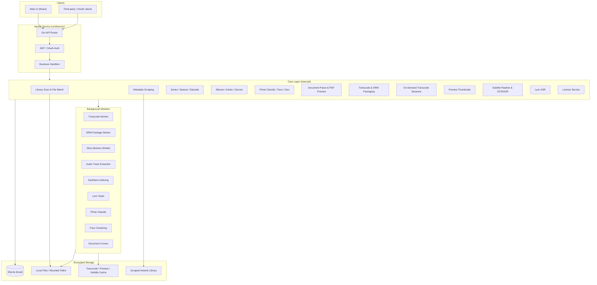
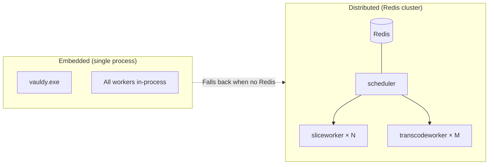

# Vauldy

**Your private, permanent, and secure family digital safe** / *私人的、永久的、安全的家庭数字保险箱*

[Go](https://go.dev)
[React](https://react.dev)
[TypeScript](https://www.typescriptlang.org)
[SQLite](https://sqlite.org)
[Docker](https://docker.com)
[Website](https://knoxmedia.github.io/)

[English](#english) · [中文](#中文)

---

## English

### Overview

**Vauldy** is a family digital safe — a self-hosted, locally encrypted vault for your movies, photos, music, documents, and cherished memories. Everything stays on your own hardware behind strong encryption. No cloud, no leaks, no surveillance. Think of it as the digital equivalent of a fireproof home safe, purpose-built for the media and memories that matter most.

Vauldy ships as a single binary with an embedded web UI, or as a Docker container. It runs anywhere — a home NAS, an old PC, a Raspberry Pi alternative, or a VPS you control.


| Item         | Details                                            |
| ------------ | -------------------------------------------------- |
| Backend      | Go 1.22+ · Gin · SQLite · Redis (optional)         |
| Frontend     | React 19 · TypeScript · Ant Design 6 · Vite 8      |
| Media Engine | FFmpeg / FFprobe · Shaka Packager                  |
| Encryption   | Widevine · FairPlay · PowerDRM · HLS AES-128       |
| Default Port | `8200`                                             |
| Platforms    | Windows / Linux / macOS / Docker                   |


**Default demo accounts** (auto-created on first boot — change immediately in production):


| Username | Password    | Role          |
| -------- | ----------- | ------------- |
| `admin`  | `admin123`  | Administrator |
| `viewer` | `viewer123` | Regular user  |


---

### Why Vauldy?

| Principle            | What it means                                                        |
| -------------------- | -------------------------------------------------------------------- |
| 🔐 **100% Local**    | Everything runs on your device. Files never leave your network.      |
| 🛡️ **Encrypted**     | Widevine, FairPlay, PowerDRM, and HLS AES-128 protect your content.  |
| 👁️ **Zero Telemetry** | No analytics, no phone-home, no tracking. Your data is yours.        |
| 🧱 **Air-gap Ready**  | Fully functional without internet access after initial setup.        |
| 🔑 **You Hold the Keys** | JWT auth, OAuth credentials, per-library ACL — you decide who sees what. |


---

### Feature Matrix

| Domain              | Capabilities                                                                                      |
| ------------------- | ------------------------------------------------------------------------------------------------- |
| 🏦 Media Vault       | Movies · TV · Anime · Music · Photos · Documents — multiple libraries, each with dedicated browse & playback UI |
| 🔐 Content Encryption | Widevine · FairPlay · PowerDRM · HLS AES-128, built-in license server                             |
| ▶️ Secure Playback   | Direct MP4 · HLS/DASH adaptive streaming · JIT on-demand transcode · Global music player          |
| 🔍 Metadata          | TMDB · TVDB · Douban · Bangumi · OMDb · AI LLM fallback                                           |
| 🖼️ Previews          | Scrubber sprite thumbnails + WebVTT timeline                                                      |
| 📝 Subtitles         | Embedded extraction · Sidecar scan · PGS bitmap OCR · Whisper ASR                                 |
| 🎵 Multi-audio       | Pre-extracted audio tracks, multi-audio HLS master playlist                                       |
| 👥 Access Control    | Multi-role accounts · Library-level ACL · Parental controls (ratings + PIN + time windows)        |
| 🔒 Auth & Tokens     | JWT sessions · OAuth client credentials · Bearer / Query token dual mode                          |
| 🛠️ Scale             | Embedded single-binary → Docker → Distributed Redis cluster                                       |


---

### System Architecture

#### Core Architecture



#### Deployment Modes



---

### Key Design Principles

1. **Data never leaves your home.** All storage is local or mounted via your own filesystem. No cloud dependencies.
2. **Encryption at rest and in transit.** DRM packaging for video content, AES-128 for HLS streams, built-in license service with audit trail.
3. **Single-binary simplicity.** `cmd/server` embeds the React frontend — one command, one process, one port.
4. **Permissions you control.** Per-library ACL, parental controls with PIN and schedule windows, OAuth credentials for external integrations.
5. **Optional scale-out.** Redis-backed distributed transcode/slice workers when a single machine isn't enough. Graceful fallback to in-process mode.
6. **Air-gap friendly.** Run fully disconnected after the initial tool/model download. No internet? No problem.

---

### Project Layout

```
vauldy/
├── cmd/
│   ├── server/           # Main entrypoint
│   ├── scheduler/        # JIT scheduler (Redis)
│   ├── schedulerd/       # Scheduler daemon (standalone)
│   ├── sliceworker/      # Distributed slice worker
│   ├── sliceworkerd/     # Slice daemon (standalone)
│   ├── transcodeworker/  # Distributed transcode worker
│   └── transcodeworkerd/ # Transcode daemon (standalone)
├── api/
│   ├── handler/          # REST handlers (~68 files)
│   ├── middleware/       # JWT · CORS
│   └── router.go
├── internal/
│   ├── scanner/          # Library scan & fsnotify watcher
│   ├── scraper/          # TMDB / Douban / Bangumi providers
│   ├── tvparse/          # TV filename parser
│   ├── tvstore/          # Series · season · episode models
│   ├── musicparse/       # Music filename / ID3 parser
│   ├── musicstore/       # Album · artist · genre aggregation
│   ├── musiclyrics/      # Lyric parsing (LRC/VTT)
│   ├── lyrictask/        # Lyric ASR tasks
│   ├── photoparse/       # Photo EXIF/GPS parser
│   ├── photoclass/       # Photo AI classify (heuristic/ONNX)
│   ├── photoface/        # Face detect & person clustering
│   ├── photogeocode/     # GPS reverse geocoding
│   ├── imagethumb/       # Photo thumb/medium generation
│   ├── docparse/         # Document metadata (PDF/EPUB)
│   ├── doccover/         # Document cover generation
│   ├── doctrans/         # Office → PDF preview
│   ├── transcode/        # HLS transcode & CMAF DRM packaging
│   ├── drm/              # Local license service
│   ├── jit/              # On-demand transcode sessions
│   ├── preview/          # Scrubber sprite thumbnails
│   ├── subtitle/         # Subtitle pipeline (extract/OCR/ASR)
│   ├── recognition/      # ASR/OCR tool install & probe
│   ├── atrack/           # Audio track extraction
│   ├── keyframe/         # Keyframe indexing
│   ├── upload/           # Chunked upload service
│   ├── monitor/          # Real-time filesystem watcher
│   ├── metadatalib/      # Local artwork library
│   ├── mediautil/        # Codec compatibility checks
│   ├── config/           # YAML config loading
│   ├── store/            # SQLite schema & migrations
│   ├── auth/             # JWT generate & validate
│   └── model/            # Internal data models
├── pkg/
│   ├── ffprobe/          # FFprobe wrapper
│   ├── fileutil/         # File type / extension detection
│   └── hashutil/         # Hash utilities
├── web/                  # React SPA frontend
│   └── src/
│       ├── pages/        # Home · Browse · Play/Read · Admin · Settings
│       ├── components/   # Music player · Photo lightbox · TV/music widgets
│       └── i18n/         # Locales: zh-CN, zh-TW, en, ja, ko
├── tools/
│   ├── ffmpeg/bin/       # ffmpeg/ffprobe binaries
│   ├── shaka-packager/   # Shaka Packager binary
│   ├── asr/              # ASR scripts (Whisper/Paraformer)
│   ├── subtitle_ocr/     # Bitmap subtitle OCR scripts
│   ├── photo_classify/   # ONNX image classification model
│   ├── photo_face/       # InsightFace detection
│   └── doctran/          # Portable LibreOffice (doc preview)
├── data/                 # Runtime data (DB/caches/uploads)
├── config.yml            # Runtime configuration
├── Dockerfile
└── docker-compose.yml
```

---

### Quick Start

#### Prerequisites

- Go 1.22+
- Node.js 20+ (frontend dev only)
- FFmpeg / FFprobe

#### Key Configuration

Edit `config.yml` before first deployment — at minimum:

```yaml
security:
  jwt_secret: "change-me-in-production-use-long-random-string"  # ⚠️ Required

ffmpeg:
  ffprobe_path: "tools/ffmpeg/bin/ffprobe.exe"   # Windows
  ffmpeg_path:  "tools/ffmpeg/bin/ffmpeg.exe"    # Linux: /usr/bin/ffmpeg

# DRM encryption
drm:
  widevine:
    enabled: false  # Requires external license service
  powerdrm:
    enabled: true   # Built-in custom encryption, works out-of-box
```

#### Development

```powershell
# Backend (from project root)
go run ./cmd/server

# Frontend (separate terminal)
cd web && npm install && npm run dev   # http://localhost:5173 → proxies API to :8200
```

#### Production

```powershell
cd web && npm run build && cd ..
go build -o vauldy ./cmd/server
./vauldy
```

#### Docker

```bash
docker build -t vauldy .

docker run -d \
  --name vauldy \
  -p 8200:8200 \
  -v ./data:/app/data \
  -v /your/media:/media \
  vauldy
```

#### First Use

1. Open `http://localhost:8200` in a browser
2. Login with `admin` / `admin123`
3. Go to **Admin Console → Libraries**, create a library (movie / TV / music / photo / document)
4. **Add folders** pointing to your media directories (Docker: ensure paths are mounted)
5. Click **Scan** — files are processed by type (video: ffprobe + scrape + previews + subtitles; music: album aggregation + lyrics; photos: thumbnails + classify/faces; documents: metadata + cover + PDF preview)
6. Return to Home once scanning finishes — browse, play, or read securely

---

### Implemented Features

#### Libraries & Scanning

- Library types: **movies, TV, anime, general video, music, photos, documents** — each has dedicated browse/play/read UI
- Multi-folder paths, enable/disable, auto-scan, **real-time filesystem watch** (fsnotify)
- Full & incremental scan tasks with progress, cancel, and **scan logs**
- Detects **video / audio / image / document** by extension; ffprobe for video, EPUB/PDF parsers for documents
- **Episode filename parsing** (`S01E01`, `Season 1`, etc.) and **series aggregation** with season/episode detail views
- Scan tuning: `fast_ffprobe`, optional file hashing (`file_hash_on_scan`)

#### Metadata Scraping

- Providers: **TMDB, TVDB, Douban, Bangumi, OMDb**, plus **AI LLM** fallback
- Auto-scrape on ingest and batch scrape tasks
- Manual match/unmatch, title parsing, TMDb image search
- Local artwork storage; poster / backdrop / logo management
- TV episode-level scraping tied to series metadata

#### Secure Playback

- **Direct progressive** playback for browser-compatible MP4
- **HLS / DASH adaptive transcode** (multi-bitrate; DASH for DRM paths)
- **JIT on-demand transcode** (Redis cluster or in-process sessions; seek/pause/resume/end)
- Player engines: **PowerPlayer, xgplayer, Shaka Player** (auto-selected per scenario)
- **Preview thumbnails** on the progress bar (sprite + WebVTT)
- Multi-audio HLS; embedded & external subtitles as WebVTT
- **Resume progress**, watched state, playback history with filtering

#### Content Encryption (DRM)

- Per-library `drm_enabled`; CMAF fMP4 HLS packaging (Shaka Packager + FFmpeg fallback)
- **Widevine, FairPlay, PowerDRM, HLS AES-128** playback paths
- Built-in license endpoints; admin audit & license verification tools
- Optional local-source cleanup after packaging (upload-origin files only)

#### Subtitles & Audio

- Auto subtitle tasks on scan: embedded track extraction, sidecar files (srt/ass/ssa/vtt/sub/…)
- Optional **Whisper ASR** speech-to-text and **PGS bitmap OCR** (Tesseract)
- Pre-extracted audio tracks for cheaper video-only HLS segments, multi-track switching

#### Music Module

- Scan: ID3/filename parsing with **album · artist · genre** aggregation
- Browse UI: **albums / artists / genres / tracks** tabs, grid/table views, in-library search & sort
- **Album detail**, **artist detail**, **genre** pages
- **Global music player**: bottom bar, fullscreen player, queue & play modes
- **Lyrics**: sidecar LRC/VTT; **ASR lyric tasks** when no lyrics exist
- Add tracks to playlists; play from home / continue listening

#### Photo Module

- Scan generates **thumb + medium** variants and reads EXIF capture time
- Browse UI: **timeline** (by month), grid/list layouts, keyword filter
- **Smart classify**: heuristics + optional **ONNX MobileNet** model
- **People**: InsightFace detect & cluster, rename persons, face thumbnails
- **Places**: GPS reverse geocode (China regions), batch backfill
- **Lightbox** with navigation and tag editing

#### Document Module

- Extensions: PDF, EPUB, Office (doc/docx/xls/xlsx/ppt/pptx), txt/md/html/csv/rtf, mobi/azw/azw3
- Scan extracts title, author, publisher, pages, tags; auto **cover** generation
- Browse UI: folder tree, **author/format/tag/year** facets, recent reads, grid/list
- **Reader**: PDF (pdf.js), EPUB (epub.js); Office via **LibreOffice/WPS/Office** → PDF preview
- **Read progress** (local + server), theme/font prefs, original download

#### User Features

- Home: library cards, **continue watching/listening**, **recently added** by media type
- Browse: poster/thumb/list/table views; auto-routes to **TV / music / photo / document** pages
- Favorites, **playlists** (sortable, multi-image), title keyword search
- Settings: profile, password, avatar upload, player preferences, **UI locale** (zh-CN / zh-TW / en / ja / ko)
- **Playback history** with per-type filters and progress clear

#### Admin Console

- Library CRUD & scan control; enqueue **full-library photo classify** for photo libraries
- Task manager: transcode / preview / scrape / subtitle / **lyrics** / scan / audio / keyframe / scheduled
- **System options**: probe, test, and one-click install for ASR/OCR/photo classify/face/doc conversion
- Scrape config (provider toggles & priority), AI Provider config (OpenAI / DeepSeek / Tongyi / Ollama)
- User management (roles / permissions / library scope / parental controls), API credentials
- DRM license audit, access logs

#### Security & Access Control

- Multi-user (admin / regular), **per-library ACL**, per-folder permissions
- **Parental controls** (rating limits + PIN + time windows + daily schedules)
- JWT sessions; OAuth client credentials for external players
- Access logs; frontend permission-error prompts for 401/403

---

### API Overview

> Playback URLs accept `Authorization: Bearer` or `?access_token=` for HTML5 players.

#### Auth & User

| Endpoint                       | Auth  | Description                        |
| ------------------------------ | ----- | ---------------------------------- |
| `POST /api/v1/user/login`      | None  | User login, returns JWT            |
| `POST /api/v1/oauth/token`     | OAuth | OAuth client credentials → token   |
| `GET /api/v1/user/info`        | JWT   | Current user profile               |
| `PUT /api/v1/user/profile`     | JWT   | Profile, `ui_locale`, player prefs |
| `GET /api/v1/playback-history` | JWT   | Playback history                   |

#### Browse & Metadata

| Endpoint                                | Auth | Description                       |
| --------------------------------------- | ---- | --------------------------------- |
| `GET /api/v1/library`                   | JWT  | List media libraries              |
| `GET /api/v1/media`                     | JWT  | Media list (filter/sort/paginate) |
| `GET /api/v1/series/:id`                | JWT  | TV series detail                  |
| `GET /api/v1/library/:id/albums`        | JWT  | Music albums                      |
| `GET /api/v1/library/:id/artists`       | JWT  | Music artists                     |
| `GET /api/v1/library/:id/tracks`        | JWT  | Music tracks                      |
| `GET /api/v1/library/:id/documents`     | JWT  | Documents                         |
| `GET /api/v1/library/:id/photo/persons` | JWT  | Photo person clusters             |

#### Playback & DRM

| Endpoint                                     | Auth      | Description                        |
| -------------------------------------------- | --------- | ---------------------------------- |
| `GET /api/v1/media/:id/play`                 | JWT/Token | Playback plan (direct/HLS/JIT/DRM) |
| `GET /api/v1/media/:id/hls/`*                | Token     | HLS segments & playlists           |
| `GET /api/v1/media/:id/dash/`*               | Token     | DASH assets (DRM)                  |
| `GET /api/v1/media/:id/preview/*`            | Token     | Progress bar sprite + WebVTT       |
| `GET /api/v1/media/:id/lyrics`               | JWT       | Lyrics content                     |
| `GET /api/v1/media/:id/document/preview.pdf` | Token     | Document PDF preview               |
| `POST /api/v1/jit/session/:id/seek`          | Token     | JIT session seek                   |
| `POST /api/v1/drm/widevine/license`          | Token     | Widevine license                   |

#### Admin

| Endpoint                           | Auth  | Description                    |
| ---------------------------------- | ----- | ------------------------------ |
| `POST /api/v1/library`             | Admin | Create library                 |
| `POST /api/v1/library/:id/scan`    | Admin | Trigger scan                   |
| `GET /api/v1/admin/overview`       | Admin | Dashboard                      |
| `GET /api/v1/admin/system-options` | Admin | ASR/OCR/photo/doc tool options |
| `GET /api/v1/lyric/task`           | Admin | Lyric recognition tasks        |

> Remaining admin endpoints (users / tasks / scrape / upload / DRM audit / …) require the **Admin** role.

---

### Roadmap

| Area                   | Status          | Description                                                                              |
| ---------------------- | --------------- | ---------------------------------------------------------------------------------------- |
| Core vault & playback  | ✅ Baseline     | Movies/TV/anime/music/photos/documents with browsing, playback, DRM encryption           |
| Metadata scraping      | ✅ Baseline     | TMDB/TVDB/Douban/Bangumi/OMDb/Fanart + Whisper ASR                                       |
| Music module           | ✅ Baseline     | Albums/artists/genres/tracks, global player, ASR lyrics                                  |
| Photo module           | ✅ Baseline     | Timeline, AI tags, faces/places                                                          |
| Document module        | ✅ Baseline     | Multi-format ingest, PDF/EPUB/Office reading, progress sync                              |
| UI i18n                | ✅ Baseline     | Frontend zh-CN/zh-TW/en/ja/ko                                                            |
| GPU acceleration       | Planned         | NVENC/QSV/AMF/VAAPI hardware transcode                                                   |
| Client bitrate switch  | Planned         | Manual quality/bitrate selection in player                                               |
| Transcode cache reuse  | Planned         | Reuse prior transcode outputs                                                            |
| One-click import       | Planned         | Migrate from Plex/Emby/Jellyfin                                                          |
| Emby API compatibility | Planned         | Emby Server API for Infuse/Kodi/etc.                                                     |
| Live TV & IPTV         | Planned         | M3U sources, channel grid, EPG                                                           |
| DLNA & casting         | Planned         | DLNA server, Chromecast discovery                                                        |
| SyncPlay               | Planned         | Synchronized multi-user playback                                                         |
| Remote access          | Planned         | Reverse proxy, HTTPS, secure external playback                                           |
| Advanced search        | Planned         | Full-text index with cast/genre/tag filters                                              |
| HDR tone mapping       | Planned         | HDR10/DV to SDR conversion                                                               |
| AI-powered features    | Planned         | Semantic search, smart rename, recommendation copy, library assistant                    |
| Backup & restore       | Planned         | Export/import settings and user data                                                     |
| Offline download       | Planned         | Mobile/PWA scheduled download of transcoded files                                        |
| LDAP / SSO             | Planned         | Enterprise directory login                                                               |
| Multi-device clients   | Planned         | Mobile/TV/PC native apps or PWA                                                          |

---

### Related Docs

| Document                                             | Purpose                                |
| ---------------------------------------------------- | -------------------------------------- |
| [FUNCTIONAL_TEST.md](./FUNCTIONAL_TEST.md)           | Manual regression checklist            |
| [cmd/scheduler/README.md](./cmd/scheduler/README.md) | JIT transcode scheduler design         |
| [docs/](docs/)                                       | Additional technical documentation     |

---

## 中文

### 项目简介

**Vauldy** 是一款家庭数字保险箱 —— 一个自托管、本地加密的媒体库，用于安全存储您的电影、照片、音乐、文档和珍贵回忆。所有数据保留在您自己的硬件上，受到强加密保护。没有云端，没有泄露，没有监控。它就像您家中的防火保险箱，专为重要的数字媒体和记忆而打造。

Vauldy 以单一二进制文件（内置 Web UI）或 Docker 容器形式发布，可在家庭 NAS、旧电脑、树莓派替代品或您拥有的 VPS 上运行。


| 项目     | 说明                                            |
| ------ | --------------------------------------------- |
| 后端     | Go 1.22+ · Gin · SQLite · Redis（可选）           |
| 前端     | React 19 · TypeScript · Ant Design 6 · Vite 8 |
| 媒体引擎   | FFmpeg / FFprobe · Shaka Packager             |
| 加密     | Widevine · FairPlay · PowerDRM · HLS AES-128  |
| 默认端口   | `8200`                                        |
| 运行环境   | Windows / Linux / macOS / Docker              |


**默认演示账号**（首次启动自动创建，生产环境请立即修改）：


| 用户名      | 密码          | 角色   |
| -------- | ----------- | ---- |
| `admin`  | `admin123`  | 管理员  |
| `viewer` | `viewer123` | 普通用户 |


---

### 为什么选择 Vauldy？

| 理念         | 说明                                          |
| ---------- | ------------------------------------------- |
| 🔐 完全本地   | 一切在您的设备上运行，文件绝不离开您的网络。                       |
| 🛡️ 加密保护   | Widevine、FairPlay、PowerDRM 和 HLS AES-128 保护您的内容。 |
| 👁️ 零遥测     | 无分析、无回传、无追踪。您的数据只属于您。                        |
| 🧱 支持离线运行  | 初始配置后无需互联网连接即可完整运行。                          |
| 🔑 您掌控密钥   | JWT 认证、OAuth 凭证、库级 ACL —— 由您决定谁能访问什么。         |


---

### 功能矩阵

| 功能域      | 核心能力                                                        |
| -------- | ----------------------------------------------------------- |
| 🏦 媒体库   | 电影 · 剧集 · 动漫 · 音乐 · 图片 · 文档，多路径多库管理，各类型均有专属浏览/播放或阅读 UI     |
| 🔐 内容加密  | Widevine · FairPlay · PowerDRM · HLS AES-128，内置许可证服务        |
| ▶️ 安全播放  | 直链 MP4 · HLS/DASH 自适应转码 · JIT 按需切片 · 音乐全局播放器 · 多播放器引擎自动切换 |
| 🔍 元数据刮削 | TMDB · TVDB · 豆瓣 · Bangumi · OMDb · AI 大模型兜底                |
| 🖼️ 预览图  | 进度条 sprite 缩略图 + WebVTT 时间线                                 |
| 📝 字幕    | 内嵌轨提取 · Sidecar 扫描 · PGS 图形 OCR · Whisper ASR               |
| 🎵 多音轨   | 音轨预提取，多音轨 HLS master playlist                               |
| 👥 访问控制  | 多角色账户 · 库级 ACL · 家长控制（分级+PIN+时段窗口）                           |
| 🔒 认证令牌  | JWT 会话 · OAuth 客户端凭证 · Bearer / Query Token 双模式              |
| 🛠️ 扩展   | 单机嵌入 → Docker → 分布式 Redis 集群                                |


---

### 快速开始

#### 开发模式

```powershell
# 后端
go run ./cmd/server

# 前端（另开终端）
cd web && npm install && npm run dev    # http://localhost:5173，API 代理到 :8200
```

#### 生产模式

```powershell
cd web && npm run build && cd ..
go build -o vauldy ./cmd/server
./vauldy
```

#### Docker

```bash
docker build -t vauldy .

docker run -d \
  --name vauldy \
  -p 8200:8200 \
  -v ./data:/app/data \
  -v /your/media:/media \
  vauldy
```

#### 首次使用

1. 浏览器访问 `http://localhost:8200`
2. 使用默认账号 `admin` / `admin123` 登录
3. 进入 **管理后台 → 媒体库**，创建媒体库（电影/剧集/音乐/图片/文档）
4. 为媒体库 **添加文件夹**（指向存放文件的目录，Docker 需确保路径已挂载）
5. 点击 **扫描**，系统按文件类型自动处理
6. 扫描完成后返回首页，即可安全浏览、播放或阅读

---

### 已实现功能

（参见上方 English 部分 [Implemented Features](#implemented-features) 的完整列表。）

---

### API 概览

（参见上方 English 部分 [API Overview](#api-overview) 的端点表格。）

---

### 开发计划

（参见上方 English 部分 [Roadmap](#roadmap) 的路线图。）

---

## Links

- Website: [https://knoxmedia.github.io/](https://knoxmedia.github.io/)
- License: [LICENSE](./LICENSE)

---

[↑ English](#english) · [↑ 中文](#中文)
